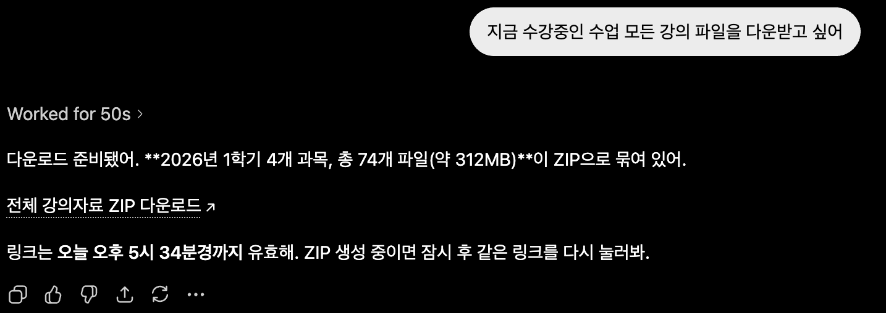
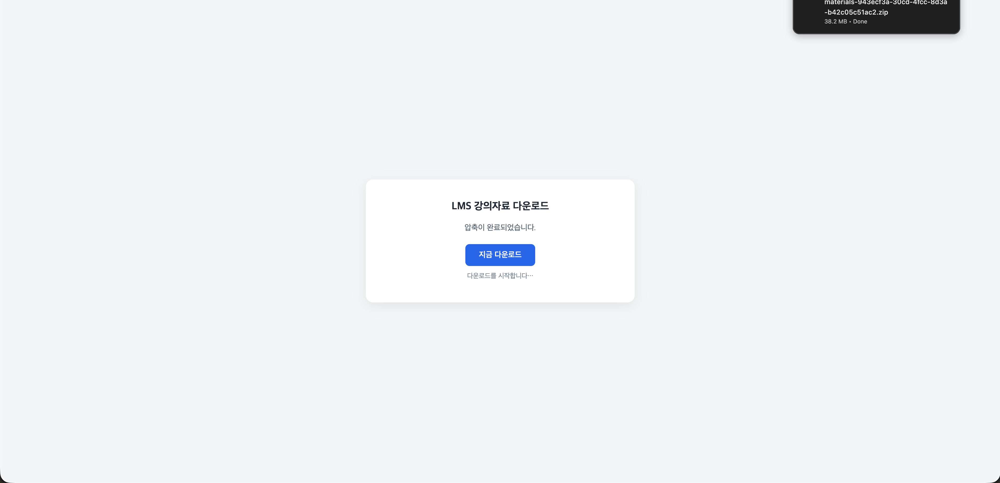

# ssuMCP — Soongsil University MCP Server

**한국어** [README.md](README.md) · **English** (this document)

> 🧩 **Soongsil Campus AI Platform** (1 of 4 services) · **ssuMCP** · [ssuAI](https://github.com/ghdtjdwn/ssuAI) · [ssuAgent](https://github.com/ghdtjdwn/ssuAgent) · [ssu-ai-service](https://github.com/ghdtjdwn/ssu-ai-service) · 🟢 [Live](https://ssuai.vercel.app)

[](https://github.com/ghdtjdwn/ssuMCP/actions/workflows/ci.yml)

A public server that exposes Soongsil University campus information as **MCP (Model Context Protocol) standard tools**.  
It also serves as the REST API backend for the [ssuAI](https://github.com/ghdtjdwn/ssuAI) web client.

> **MCP endpoint**: `https://ssumcp.duckdns.org/mcp`  
> **Grafana**: `https://ssumcp.duckdns.org/grafana`

---

## Why I Built This

Checking everyday information — the cafeteria menu, library seats, grades, my timetable — meant digging through the school portal every single time. Instead of writing yet another crawler, I decided that building an MCP server that lets an LLM call the university's data directly as tools would make it reusable everywhere: chatbots, IDEs, automation pipelines.

Connect it to Claude Desktop and requests like *"What's on the cafeteria menu today?"*, *"Show me this semester's grades"*, or *"Reserve an open library seat for me"* are answered — or acted upon — by the LLM fetching the data itself.

---

## ChatGPT + ssuMCP in Action

In real ChatGPT sessions connected to ssuMCP, the client retrieved personal academic data, completed a
library-seat reservation that required confirmation, and exported supported LMS course materials. These
screenshots document successful integration cases without repeating personal values or session details in
the surrounding prose.

**u-SAINT graduation evaluation — summarizing the remaining requirements**


**Library seat reservation — checking availability and returning the result after client confirmation**


**LMS course-material export — collecting supported files across all courses into a ZIP download**





The OAuth session boundary and ChatGPT MCP connection are recorded in
[ADR 0038](docs/adr/0038-chatgpt-mcp-oauth-auth0-dcr.md); the two-step confirmation contract for write tools
is recorded in [ADR 0086](docs/adr/0086-confirm-action-async-and-scoped-supersede.md). The LMS export bundles
supported files while excluding video and audio. Its asynchronous ZIP build and download authorization follow
[ADR 0033](docs/adr/0033-lms-material-zip-export.md), all-course collection follows
[ADR 0035](docs/adr/0035-lms-export-all-materials.md), and the download token is consumed once as defined in
[ADR 0067](docs/adr/0067-lms-single-use-download-token.md).

---

## Getting Connected

### Claude Desktop

`%APPDATA%\Claude\claude_desktop_config.json` (Windows) /  
`~/Library/Application Support/Claude/claude_desktop_config.json` (macOS):

```json
{
  "mcpServers": {
    "ssuMCP": {
      "url": "https://ssumcp.duckdns.org/mcp"
    }
  }
}
```

After restarting, the tool list appears under the tools icon in the chat window.

### Cursor / other MCP clients

`.cursor/mcp.json`:

```json
{
  "mcpServers": {
    "ssuMCP": {
      "url": "https://ssumcp.duckdns.org/mcp"
    }
  }
}
```

---

## Tools (52)

### Public tools — no authentication required

**Cafeteria · Facilities · Library**

| Tool | Description |
|------|-------------|
| `get_today_meal` | Today's cafeteria menu |
| `get_meal_by_date` | Cafeteria menu for a specific date |
| `get_meal_weekly` | Weekly cafeteria menu |
| `get_dorm_weekly_meal` | Residence hall weekly menu |
| `search_campus_facilities` | Search campus facilities |
| `get_library_seat_catalog` | Static catalog of library seats and reading rooms |
| `search_library_book` | Search the central library collection |

**Academic (Academic Policy RAG)**

| Tool | Description |
|------|-------------|
| `get_academic_calendar` | Academic calendar lookup |
| `find_academic_calendar_events` | Filter academic calendar events by month/keyword |
| `classify_academic_question` | Classify the intent of an academic question |
| `search_academic_policy_sources` | Search official regulation / graduation / scholarship sources |
| `get_academic_policy_brief` | Summarize academic regulations from official sources |
| `check_scholarship_policy` | Check given conditions against scholarship criteria, with cited evidence |
| `list_academic_policy_sources` | List the official sources in the academic RAG corpus |

Questions about academic regulations, graduation, and scholarships are answered by fetching the source documents from `rule.ssu.ac.kr` and `ssu.ac.kr` after server startup to refresh the corpus, then searching with a lexical + embedding **RRF hybrid** (ADR 0020; see Architecture below). Tool responses include `url`, `revision`, `effectiveDate`, `live`, `fallbackUsed`, and `embeddingUsed`. `get_academic_calendar` and `find_academic_calendar_events` scrape the server-rendered monthly blocks of the main site at `ssu.ac.kr/학사/학사일정/?years={year}` (ADR 0054; real data carries no category labels).

**Notices**

| Tool | Description |
|------|-------------|
| `get_recent_notices` | Latest university notices |
| `search_notices` | Keyword search over notices |
| `list_notice_categories` | List notice categories |
| `get_notice_detail` | Full notice body |
| `get_active_notices` | Notices still open (deadline not passed) |
| `get_department_notices` | Notices by department/office |

### Personal tools — authentication required

Authentication flow:

1. `start_auth(provider="SAINT")` → receive `loginUrl` + `mcpSessionId`
2. Open `loginUrl` in a browser and sign in with a Soongsil University account
3. Pass the `mcp_session_id` parameter on subsequent personal tool calls

**Session management**

| Tool | Description |
|------|-------------|
| `start_auth` | Issue a login URL (provider: SAINT / LMS / LIBRARY) |
| `get_auth_status` | Check session status |
| `logout_provider` | Unlink a specific provider |
| `logout_all` | Clear the entire session |

**u-SAINT (provider: SAINT)**

| Tool | Description |
|------|-------------|
| `get_my_schedule` | Timetable (semester selectable) |
| `get_my_grades` | Grades and cumulative GPA |
| `get_my_chapel_info` | Chapel attendance status |
| `check_graduation_requirements` | Graduation requirement check |
| `evaluate_graduation_with_policy` | Graduation check together with official regulation evidence |
| `get_my_scholarships` | Scholarship award history |
| `simulate_gpa` | Project cumulative GPA from this semester's expected grades |

**LMS (provider: LMS)**

| Tool | Description |
|------|-------------|
| `get_my_assignments` | Unsubmitted assignments and quizzes for the current term |
| `get_my_lms_terms` | List the user's registered LMS terms |
| `get_lms_dashboard` | Dashboard combining unsubmitted assignments, academic calendar, and notices |
| `get_my_lms_courses` | List the user's LMS courses |
| `get_my_lms_materials` | List non-video weekly course materials (PDF, PPT, etc.; video/audio excluded) |
| `prepare_lms_material_export` | Prepare an export of selected materials (validates size/count limits, creates an ActionAudit) |
| `confirm_lms_material_export` | Final export approval; issues a download link valid for 20 minutes |
| `export_all_lms_materials` | Auto-collects all materials and returns a preview; requires `confirm_lms_material_export` |

**Library (provider: LIBRARY)**

| Tool | Description |
|------|-------------|
| `get_library_seat_status` | Seat status by floor (2F / 5F / 6F) |
| `get_library_available_seats` | Live per-seat availability summary across all reading rooms |
| `get_room_available_seats` | Per-seat status list for a specific reading room (available/occupied/away/inactive) |
| `recommend_library_seats` | Preference-based seat recommendations |
| `prepare_reserve_library_seat` | Prepare a seat reservation → requires `confirm_action` |
| `wait_for_library_seat` | Join the seat waitlist — a background worker auto-reserves once a seat frees up (the call itself is consent; no `confirm_action` needed) |
| `get_library_wait_status` | Latest waitlist status |
| `cancel_library_wait` | Cancel a waitlist entry (only before the reservation starts) |
| `get_my_library_seat` | Currently reserved seat |
| `prepare_swap_library_seat` | Prepare a seat move → requires `confirm_action` |
| `prepare_cancel_library_seat` | Prepare a seat return → requires `confirm_action` |
| `confirm_action` | Final execution of write operations (two-step confirmation pattern) |
| `get_my_library_loans` | Library loans (with due dates) |

---

## Architecture

The system consists of three services:


`ssuMCP` is the MCP tool server — atomic domain tools, direct integration with the university's systems, fault tolerance, and action auditing. `ssuAgent` is the LangGraph orchestrator — natural-language intent detection, tool composition, and HITL interrupts. The two services communicate only through the MCP protocol, so each deploys independently.

The REST and MCP paths share the same Service layer; MCP tools carry no business logic of their own.

See the [detailed architecture document](docs/architecture.md) for runtime, data, and delivery boundaries. A [PNG version](docs/assets/architecture.png) is also available.

Questions about academic regulations, graduation, and scholarships are handled by **hybrid search** with official-source traceability — keyword lexical scores and embedding cosine similarity fused via **RRF (Reciprocal Rank Fusion)**. Embeddings are persisted (base64 float32) in the `academic_embeddings` table keyed by `(chunk_hash, model)`, so pod restarts and periodic refreshes never re-consume the free-tier daily embedding quota (only not-yet-embedded chunks get embedded). If embeddings are disabled or fail, search automatically degrades to lexical-only, surfaced through the `embeddingUsed` (rrf/lexical) response field (ADR 0020). After server startup and on periodic refresh,
the source documents are fetched from `rule.ssu.ac.kr` and `ssu.ac.kr` to update the corpus, and tool responses include
`url`, `revision`, `effectiveDate`, `live`, and `fallbackUsed`. Personal graduation evaluation
returns u-SAINT data alongside this official evidence.

### Connector pattern

Every call to an external system is abstracted behind an interface.

```
MealConnector (interface)
├── MockMealConnector   — returns fixed fixtures (default)
└── RealMealConnector   — parses the real cafeteria site with Jsoup
```

`@ConditionalOnProperty` injects the implementation based on `ssuai.connector.meal=mock|real`.  
Since the default is `mock`, the project builds, tests, and runs locally without any external network.

### LLM chat engine

`LlmChatService` falls back sequentially across 10 providers using the OpenAI-compatible API format. Dead providers are cooled down by per-provider Resilience4j Circuit Breakers (`llm-{provider}`), so instead of being retried on every request they are skipped straight to the next provider (ADR 0025).

```
User message
    → LlmChatService
    → LlmProvider chain (Gemini → Groq → OpenRouter → Cerebras → ... 10 total)
        On rate limit / server error / CB OPEN, automatically moves to the next provider
    → When a tool_call occurs
        Public tools: McpSyncClient → its own /mcp (self-dogfood)
        Personal tools: direct Service call with web session context (ThreadLocal)
    → Final response
```

### Automated library seat reservation (write tools)

Library reservation, seat move, and seat return use the `prepare_* → confirm_action` two-step confirmation pattern.

```
get_library_available_seats
    → check the list of open seats (externalSeatId, label, status)
    → prepare_reserve_library_seat(seat_id)
    → confirmation message shown ("Reserving seat 25 in the Open Reading Room. Confirm?")
    → confirm_action(pending_action_id)
    → actual Pyxis reservation executes
```

When no seat is available, `wait_for_library_seat` registers an asynchronous reservation intent. A background worker polls for matching seats, auto-reserves as soon as one frees up, and streams the waitlist status in real time over SSE (see "Async reservation concurrency" below).

---

## Engineering Notes

A record of the problems hit during implementation and the reasoning behind each decision. Full details are in [Troubleshooting Highlights](docs/troubleshooting-highlights.md) (Korean).

### u-SAINT: SAP WebDynpro reverse engineering → pivot to rusaint FFI

u-SAINT runs on SAP NetWeaver WebDynpro, where `sap-contextid`, `sap-ext-sid`, `SAPEVENTQUEUE`, and friends are statefully entangled. I spent 8 days on direct HTTP reverse engineering, but guessing at the protocol without wire-level ground truth had clear limits.

I pivoted to bridging the proven Rust implementation [rusaint](https://github.com/EATSTEAK/rusaint) into the JVM via JNA (Java Native Access) FFI. The `sToken` from the SmartID callback is handed to rusaint's `withToken` exactly once, and the resulting session is stored encrypted with AES-256-GCM.

### WAF cookies + CookieManager isolation

Packet capture in the browser DevTools pinpointed that the university's security appliance (WAF) demotes a session to anonymous (ANON) when a specific cookie is missing. The fix was to preserve the `WAF` cookie alongside the `MYSAPSSO2` cookie that had been forwarded on its own until then.

In the LMS Canvas 5-hop SSO chain, manual cookie merging contaminated cookies across subdomains. Creating a per-request `HttpClient` equipped with an isolated `java.net.CookieManager` reproduced browser-grade, per-domain cookie isolation.

### Single-flight cache

SAP WebDynpro is stateful — you page through semesters one at a time with a "previous" button. On top of a 1-hour TTL cache, concurrent duplicate requests during a cold start are handled with a single-flight pattern: only the first request goes upstream, and the rest share its result.

### Reverse engineering the Pyxis per-seat API

With no official documentation, I traced the Pyxis library API through the browser DevTools Network tab and discovered the `GET /pyxis-api/1/api/rooms/{roomId}/seats` endpoint. Combining each seat's `isActive`, `isOccupied`, and `seatChargeState` fields maps to four states — available/occupied/away/inactive — powering a real-time per-seat lookup tool. This data enabled the exact seat-level reservations that were previously impossible.

### Async reservation concurrency — intent queue · per-seat distributed locks · SSE (EPIC 4·5)

If seat reservation stays a synchronous call, concurrent requests for the same seat send duplicate writes upstream (to Pyxis) and block LLM calls for a long time. `wait_for_library_seat` was restructured into an asynchronous intent that is queued and processed by a background worker. Concurrency is serialized per seat with a **Redisson distributed lock** (`LibraryDistributedLockClient`), but the source of truth for consistency is Postgres `SELECT … FOR UPDATE` — the lock exists for efficiency only (even if the lock dies, the DB still blocks duplicate reservations). Waitlist/result state is pushed in real time via **Redis RTopic fan-out based SSE** (`GET /api/library/reservations/wait/events/{intentId}`) — whichever pod ends up processing an intent, the update propagates to every subscriber. Rationale and alternatives: ADR 0047 (distributed lock) and 0048 (SSE).

### Spring AI reflection workaround

`McpServer.SyncSpecification.tools` is `package-private final`, so there was no public API for injecting tool annotations (`readOnlyHint`, `destructiveHint`). A `@Primary McpSyncServerCustomizer` replaces the auto-configured bean and rebuilds the tool list via reflection. It is a temporary bridge to be removed once Spring AI exposes a public API.

### Observability 3 pillars (metrics · distributed tracing · centralized logs)

**Metrics**: Spring Boot Actuator + Micrometer Prometheus registry. kube-prometheus-stack is deployed to the production cluster as an ArgoCD `monitoring` Application, and the `ssuai-backend` ServiceMonitor scrapes `/actuator/prometheus` — a 13-panel RED dashboard plus 3 PrometheusRules (5xx>5%, p99>3s, circuit breaker OPEN). Grafana lives at `https://ssumcp.duckdns.org/grafana`.

**Distributed tracing + centralized logs** (ADR 0069): Micrometer Observation bridge → OTel → OTLP → **Tempo**; Logback JSON → Promtail → **Loki**. Every provider attempt emits an `llm.provider.call` span, so **the 10-provider fallback sequence shows up verbatim in the trace timeline**. I chose a code-level bridge over the (zero-code) javaagent to express custom domain spans. **Live in prod** — Tempo/Loki/Promtail are deployed via ArgoCD (single-binary, within the single-ARM-node budget) and backend emission is on (`json-logs` + 0.1 sampling), so TraceQL `service.name=ssuai` traces and Loki logs are queryable in Grafana. Every trap hit while enabling it (Boot 4 moved OTLP autoconfig to `spring-boot-starter-opentelemetry`, so low-level deps alone create no exporter — root-caused with `gradle dependencies` / Loki `reject_old_samples` / k3s Promtail symlink mounts / distroless probes) has been resolved and documented. Code defaults are sampling 0 + profile-gated, so nothing is affected until it is switched on. Local demo: `load-tests/docker-compose.yml --profile full`. (The MDC `traceId` key collision was resolved by renaming the existing filter to `requestId` — client contract unchanged.)

---

## Security Principles

- **No secrets in logs**: passwords, session cookies, JWTs, and API keys are never written to logs.
- **Seat aggregate cache boundary**: per-floor global counts are cached by `floor + upstream-token presence`; raw tokens, user identifiers, and personal seat data are absent from both key and value. Production public reads use the internal sampler token.
- **Read-only MCP**: most tools are marked `readOnlyHint=true`; `logout_*` tools are marked `destructiveHint=true`.
- **Write tool design principle**: state-changing tools such as reserve/cancel are implemented only through the `prepare_*` + `confirm_action` two-step confirmation pattern. (ADR 0015)

### Security hardening (2026-06 remediation)

Findings collected from several independent security reviews were **triaged against the code into real / false positive / already fixed** before anything shipped. The 2026-07-14 live-tool audit found and fixed a P0 explicit-session fallback: an explicit MCP ID is now resolved exactly, an invalid ID returns `INVALID_SESSION`, a transport mismatch returns `SESSION_MISMATCH`, and transport binding is considered only when the ID is omitted (ADR 0098). Other controls include OAuth-sub ownership guard (ADR 0056), CSRF Origin/Referer validation (ADR 0057), prod configuration fail-fast (ADR 0058), reservation audit as the single source of truth + fail-closed seat locking (ADR 0059), `/api/chat` read-only (ADR 0060), per-IP limits (ADR 0061), and supply-chain SHA pinning + pod security (ADR 0062).

- Shipped controls: [`docs/security.md`](docs/security.md) §14-1 (Korean)
- Deferred / follow-up items: [`docs/security-followups.md`](docs/security-followups.md) (Korean)

---

## Tech Stack

| Category | Technology |
|----------|------------|
| Language / Framework | Java 21 + Kotlin 2.3, Spring Boot 4.0 |
| MCP implementation | Spring AI 1.1 (Streamable HTTP, SDK 0.18.3 — 4 artifacts pinned as a set) |
| Concurrency / Distribution | Redisson 4.5 (per-seat distributed locks · RTopic multi-pod fan-out · leader election), PostgreSQL `SELECT FOR UPDATE SKIP LOCKED` |
| Resilience | Resilience4j 2.3 core (per-provider circuit breakers · retry · rate limiter · bulkhead) |
| u-SAINT integration | rusaint — Rust/UniFFI library bridged into the JVM via JNA 5.18 |
| Academic policy search | Source-traceable **hybrid RAG** — lexical + embedding cosine RRF (k=60) fusion, persistent `academic_embeddings` cache (optional pgvector HNSW profile to demonstrate ANN capability, ADR 0070) |
| Auth | JJWT 0.13 (HS256, **decoupled from Jackson via the gson serializer**) · OAuth2.1 resource server · AES-256-GCM |
| Observability | Micrometer/Prometheus metrics + OTel/Tempo distributed tracing + Logback JSON/Loki centralized logs (ADR 0069) |
| Testing | JUnit 5 · **Testcontainers** (integration tests against real PG16/Redis7) · **JaCoCo coverage ratchet** · WireMock 3 · k6 (ADR 0068) |
| Infra | Oracle Cloud ARM64 · k3s · Traefik · ArgoCD (Image Updater GitOps) · Helm · GHCR (ARM64) · Prometheus/Grafana |
| DB | PostgreSQL 17 + Flyway (vendor-split migrations) |
| Scraping | Jsoup 1.22 |

---

## Local Development

### Run (mock mode — no external network required)

```bash
./gradlew bootRun
# http://localhost:8080
```

Inspect the tools with MCP Inspector:

```bash
npx @modelcontextprotocol/inspector
# Transport: Streamable HTTP  URL: http://localhost:8080/mcp
```

### Run (real data)

```bash
cp .env.example .env
SSUAI_CONNECTOR_MEAL=real ./gradlew bootRun
```

### Verify

```bash
./gradlew test                                                  # unit + (with Docker) Testcontainers integration tests against real PG/Redis
./gradlew test jacocoTestReport jacocoTestCoverageVerification  # coverage ratchet gate (LINE 0.70 floor)
./gradlew build
```

> ~1,030 tests (0 failures). Container-backed integration tests auto-skip without Docker (`disabledWithoutDocker`), keeping offline builds green; CI is the authoritative gate.

---

## Environment Variables

See `.env.example` for the main variables. Real values are never committed to the repository.

| Variable | Description |
|----------|-------------|
| `SSUAI_JWT_SECRET` | HS256 signing key (32+ bytes). Regenerated on every restart if unset |
| `SSUAI_CREDENTIAL_ENCRYPTION_KEY` | AES-GCM session encryption key |
| `SSUAI_CONNECTOR_MEAL` | `mock` (default) or `real` |
| `SSUAI_OPENROUTER_API_KEY`, ... | LLM provider keys (each optional) |

---

## Backend / AI Portfolio Highlights

Key decisions that go beyond plain CRUD and tackle real engineering problems:

### 1. Pyxis external API fault tolerance (EPIC 2)

The university library API (`oasis.ssu.ac.kr`) gets unstable during exam periods, so I built 4-layer protection with Resilience4j.

- **Key decision**: read/write asymmetry. Only reads retry (3 attempts, exponential backoff) — writes are not idempotent, and retrying risks double reservations.
- **Measured**: shared CircuitBreaker "pyxis" — slidingWindow 20, failureThreshold 50%, 30s wait, 3 probes half-open.
- **Grafana**: `resilience4j_circuitbreaker_state{name="pyxis"}` · failure rate · slow call rate panels.

### 2. Write tool safety design — action audit state machine (EPIC 3)

`prepare_* → confirm_action` two-step confirmation pattern. No real Pyxis call happens unless the user explicitly confirms.

- **Duplicate confirm prevention**: the `action_audit` row's PREPARED state is transitioned atomically under `SELECT FOR UPDATE`; a second confirm finds no row and returns an error.
- **Write timeout recovery**: after a timeout, `getCurrentCharge` (GET, idempotent) checks Pyxis's actual state → the action_audit is updated.
- **k6 experiment result**: 100 concurrent bursts on the same seat → SUCCESS 2 · FAILURE_RACE 98 · ghost reservations 0.

### 3. k6 load experiments (EPIC 1)

Baseline numbers were measured and locked in first, before starting the EPIC 2/3/4 improvements.

| Scenario | Result |
|----------|--------|
| `get_library_seat_status` 50 RPS · 5 min | p95 **19.7ms** · 0% errors · ~99% cache hit rate |
| Write burst, 100 concurrent (same seat) | SUCCESS 2 · RACE 98 · ghost 0 |
| Write burst, 100 concurrent (different seats) | SUCCESS **100** · 100% completion |

> Full experiment design, results, and interpretation: [`docs/performance/library-agent-load-test.md`](docs/performance/library-agent-load-test.md) (Korean)

### 4. rusaint JNA FFI — u-SAINT SAP WebDynpro integration

u-SAINT runs on SAP NetWeaver WebDynpro, and standard HTTP reverse engineering failed after 8 days. I pivoted to bridging the proven Rust implementation rusaint into the JVM via JNA.

- Only the SmartID SSO callback's `sToken` and `sIdno` are received → passed to `RusaintUniFfiClient` → grades / timetable / graduation / scholarship lookups.
- Passwords never touch the server (SmartID handles them).

### 5. LangGraph multi-agent system — ssuAgent (EPIC 6)

Split out from ssuMCP as a separate Python service; connected only through the MCP protocol.

- **Supervisor → Library · Academic · LMS agents** — 3-way routing.
- **HITL interrupts**: when a `prepare_reserve_library_seat` result carries an `actionId`, the graph interrupts → the user confirms → execution resumes with `confirm_action`.
- **Multi-LLM fallback**: Groq llama-3.3-70b → Gemini 2.5 Flash → OpenRouter llama-3.3-70b (Groq goes first thanks to its 14,400 free daily quota).

### 6. MCP session isolation (ADR 0098)

Independent SAINT, LMS, and library sessions are managed under one `mcp_session_id`. A supplied
ID is resolved exactly and never falls back to a transport or OAuth session; transport binding is
used only when the ID is omitted.

```
explicit mcp_session_id → McpAuthSession (7d Postgres persistence)
                │
                ├─ per-provider links (SAINT / LMS / LIBRARY)
                └─ safe transport restoration only when the ID is omitted
```

The sToken, LMS cookies, and Pyxis-Auth-Token are stored encrypted with AES-256-GCM.

---

## Documentation

- [Architecture](docs/architecture.md) (Korean)
- [Failure Scenarios](docs/failure-scenarios.md) (Korean)
- [Interview Q&A](docs/interview-qa.md) (Korean)
- [MCP Tools & Auth Flow](docs/mcp-tools.md) (Korean)
- [Security Policy](docs/security.md) (Korean)
- [Performance Report (EPIC 1 k6)](docs/performance/library-agent-load-test.md) (Korean)
- [Troubleshooting Highlights](docs/troubleshooting-highlights.md) (Korean)
- [52-tool Live Audit Remediation](docs/audits/2026-07-14-live-tool-hardening.md)
- [Deployment Runbook](deploy/README.md) (Korean)

---

## Related Projects

**[ssuAI](https://github.com/ghdtjdwn/ssuAI)** — Next.js web client (chatbot UI + dashboard)  
**[ssuAgent](https://github.com/ghdtjdwn/ssuAgent)** — Python LangGraph multi-agent orchestrator

---

## License

MIT — [LICENSE](LICENSE)
