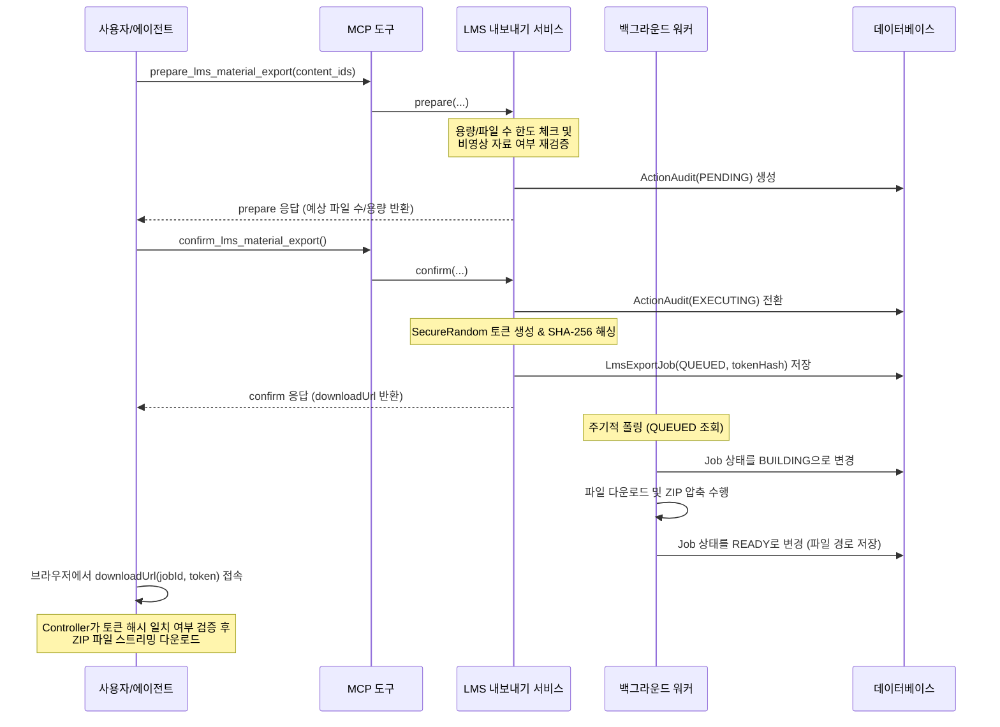

# ADR 0033 — LMS 비영상 주차학습 자료 ZIP 내보내기 및 현재 학기 버그 수정

- **Status**: Accepted
- **Date**: 2026-06-16

## 배경

학생들이 시험 공부나 강의 복습 시 LMS(Canvas)에 업로드된 주차별 비영상 강의 자료(PDF, PPT, DOC, HWP 등)를 일일이 다운로드하는 과정은 매우 번거롭고 시간이 많이 소요된다. 이를 자동화하여 한 번에 ZIP 파일로 내보낼 수 있는 기능을 추가하고자 한다. 

또한, 기존 LMS 도구들이 "현재 학기"를 식별할 때 Canvas의 `defaultTerm` 플래그를 사용하는데, 이 플래그가 실제 수업 수강 학기가 아닌 "수강신청/등록을 위해 열린 다음 학기(예: 봄학기 수강 중 여름학기 등록 오픈)"를 가리키는 버그가 확인되어 날짜 기반으로 학기를 정확히 판별하는 로직이 필요하게 되었다.

## 검토한 대안

### 1. Canvas Files API (`GET /api/v1/courses/{id}/files`) 직접 사용
- **평가**: 교수가 Canvas 내 "파일" 탭을 비활성화한 경우(숭실대 LMS 환경에서 흔함) 403 Forbidden 에러가 발생하여 자료 수집이 불가능함. 탈락.

### 2. Canvas Modules API만 활용
- **평가**: 주차학습의 LTI 연동 외부 링크(웅진 Commons) 정보만 제공하고 실제 원본 파일의 유형과 다운로드 링크를 획득할 수 없음. 탈락.

### 3. LearningX modules API + Commons content.php 3단계 파이프라인 (채택)
- **평가**: 실제 원본 파일 명칭, 확장자 및 다운로드 URL까지 실시간 검증을 거쳐 다운로드 가능. 비디오는 제외하고 문서만 추출 가능한 가장 확실한 방법.

### 4. 동기식 파일 다운로드 및 스트리밍
- **평가**: 대용량 파일 압축 및 스트리밍 시 HTTP 커넥션 타임아웃, MCP 액션 TTL(5분) 초과 우려. 비동기 백그라운드 빌드 및 capability URL 활용으로 해결.

## 결정

1. **LearningX modules API**(`https://canvas.ssu.ac.kr/learningx/api/v1/courses/{courseId}/modules?include_detail=true`)와 **Commons content.php**(`https://commons.ssu.ac.kr/viewer/ssplayer/uniplayer_support/content.php?content_id={contentId}`) 연동을 통해 비영상 파일(pdf, ppt, doc, hwp 등)을 안전하게 자동 수집한다.
2. **비동기 큐 작업 방식**: `prepare` 단계에서 파일 목록을 검증하고 `ActionAudit`을 생성한 뒤, `confirm` 단계에서 고유 토큰이 포함된 임시 다운로드 링크를 반환하고, 백그라운드 `@Scheduled` 워커가 ZIP 파일을 빌드한다.
3. **현재 학기 판별 개선**: `LmsTermResolver`를 도입하여 현재 시간(now)이 학기 시작일(`startAt`)과 종료일(`endAt`) 사이에 오버랩되는 학기를 최우선 선정하고, 일치하는 학기가 없을 때에만 `defaultTerm` 플래그 및 첫 학기로 폴백한다.

## 어떻게 작동하는지

### 3단계 API 파이프라인
1. **과목 목록 조회**: `GET /api/v1/courses?enrollment_state=active&per_page=100`로 현재 학기에 매칭되는 과목을 필터링한다.
2. **주차별 학습 자료 조회**: `GET /learningx/api/v1/courses/{courseId}/modules?include_detail=true` 호출 후 `content_data.item_content_data`에서 파일명과 타입 정보를 추출하고, 비영상 확장자 화이트리스트에 부합하는 자료만 필터링한다. (영상 타입인 `everlec`은 제외)
3. **다운로드 경로 해석**: `GET https://commons.ssu.ac.kr/viewer/ssplayer/uniplayer_support/content.php?content_id={contentId}` XML 응답에서 `content_download_uri`를 추출하여 unescape 처리 후 절대 경로 다운로드 링크를 조립한다.

### 비동기 내보내기 흐름

## 결과

- **보안 및 저작권 준수**: 강의 영상(MP4)은 엄격히 차단되고 오직 학생 본인의 학습을 위한 문서 형식 자료만 자동 수집하여 법적 리스크 최소화.
- **용량 및 트래픽 제어**: 500개 파일 / 2GB 한도를 초과하는 요청에 대해 "한도 초과"로 자동 분류 및 예외 처리하여 서버 인프라 보호.
- **사용자 경험 극대화**: 다운로드 링크는 20분간 유효하며, 20분 경과 후 백그라운드 스위퍼가 임시 파일을 완전 삭제하여 디스크 누수 방지.
- **학기 정보의 정확성**: 다음 학기 사전 등록 기간 동안 기존 학기 성적이나 대시보드 조회가 새로운 학기로 덮어씌워지는 버그 원천 해결.

## 근거와 출처

- AGENTS.md Rule 2: 포트폴리오의 실용성과 직무 완성도 최우선 고려.
- u-SAINT 및 Canvas 연동 기능의 프로덕션 운영 중 확인된 실제 에지 케이스(현재 학기 판별 버그)를 바탕으로 개선.
