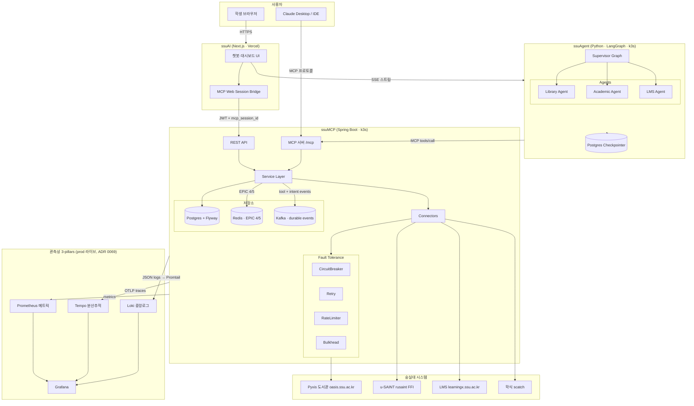
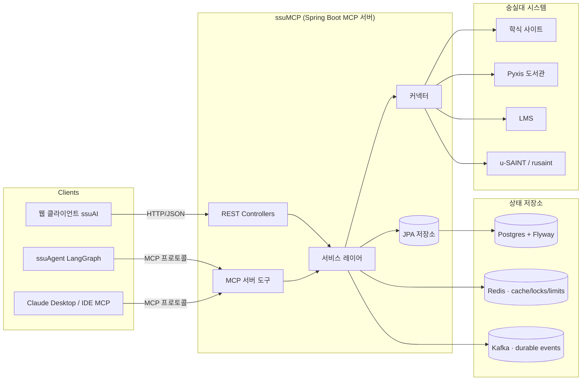
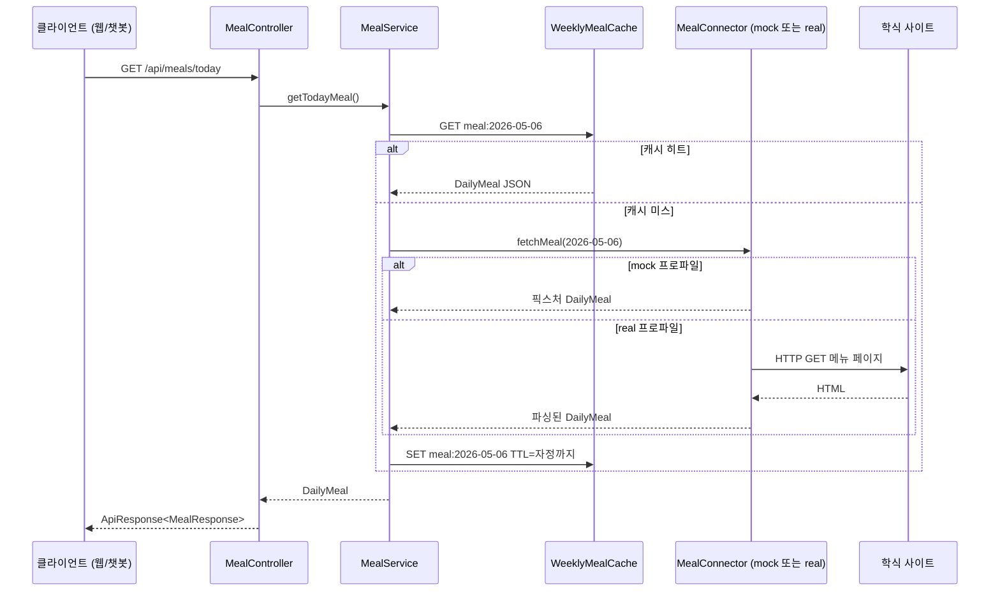

# ssuMCP 아키텍처

> 패키지명은 `com.ssuai` 로 유지 (ssuAI 모노레포에서 분리됨, 리네임 예정 없음).
> 현재 아키텍처 스냅샷 기준일: 2026-07-17 (2–3 pod HA, Kafka event backbone, GitOps 운영 반영). 과거 설계 결정은 `docs/adr/`에 보존됨.

## 이 문서의 목적

ssuMCP가 어떻게 구성되어 있는지 한눈에 파악할 수 있는 단일 뷰를 제공한다: 레이어, 패키지, 런타임 프로세스, 그리고 각 요소 간의 계약. 이 프로젝트에 새로 합류하거나 리뷰하는 사람이 5분 안에 읽고 새 기능이 어디에 위치해야 하는지 알 수 있어야 한다.

## 비목표

이 문서는 출시된 서버 경계와 action 레이어를 설명한다. 상세한 도구 인자는 `docs/mcp-tools.md`에, 보안 규칙은 `docs/security.md`에, 배포 운영은 `deploy/README.md`에 있다.

---

## 전체 구성


[PNG 버전](assets/architecture.png)

---

## 1. 시스템 컨텍스트

### 1-1. 전체 시스템 (ssuAI + ssuAgent + ssuMCP)



### 1-2. ssuMCP 단독 컨텍스트



모든 upstream 연동은 Connector 패턴으로 캡슐화된다. 프로덕션은 real 또는 `rusaint` 커넥터, 로컬·테스트는 결정적인 mock 커넥터를 선택한다.

**서비스 엔드포인트:**
- ssuMCP: `https://ssumcp.duckdns.org/mcp` (MCP) · `https://ssumcp.duckdns.org/grafana` (Grafana)
- ssuAgent: `https://ssuagent.duckdns.org` (SSE 스트림)
- ssuAI: `https://ssuai.vercel.app` (Next.js 프론트엔드)

---

## 2. 런타임 토폴로지

각 ssuMCP pod는 **하나의 Spring Boot 프로세스**로 다음 두 표면을 함께 노출한다. 프로덕션은 기본 2개 replica로 실행하고 CPU HPA가 최대 3개까지 확장한다(ADR 0088).

- 웹 대시보드와 챗봇 UI를 위한 REST API.
- 외부 클라이언트를 위한 MCP 서버 (Spring AI Streamable HTTP `/mcp`).

두 표면은 **동일한 Service 레이어**, 커넥터, repository, cache·session 정책을 공유한다. REST와 MCP 사이에 중복된 비즈니스 로직이 없다. PostgreSQL은 durable source of truth이고 Redis는 cache·lock·rate-limit·rollback pub/sub, Kafka는 영속 event fan-out을 담당한다.

```
┌────────────────────────────────────────────┐
│  ssuMCP pod (Spring Boot, pod당 단일 JVM)     │
│                                            │
│   ┌───────────┐         ┌──────────────┐   │
│   │ REST API  │         │  MCP 서버    │   │
│   └─────┬─────┘         └──────┬───────┘   │
│         └──────────┬───────────┘           │
│                    ▼                       │
│              서비스 레이어                  │
│                    │                       │
│       ┌────────────┴────────────┐          │
│       ▼                         ▼          │
│  저장소                       커넥터         │
└───────┬──────────────────────────┬─────────┘
        ▼                          ▼
 JPA/PostgreSQL              외부 학교 시스템
 Redis · Kafka
```

**pod 안에서 단일 프로세스인 이유:** REST와 MCP가 같은 도메인 규칙과 transaction을 사용하므로 하나의 배포 단위와 설정 표면이 중복을 줄인다. scale-out은 이 프로세스를 복제하고 PostgreSQL·Redis·Kafka가 pod 간 상태와 이벤트를 조정한다. 두 adapter를 별도 서비스로 분리하는 것은 독립 부하나 릴리즈 주기가 실제로 생길 때 검토한다.

---

## 3. 레이어드 아키텍처

이 프로젝트는 `CLAUDE.md`에 설명된 레이어드 구조를 따른다. 각 레이어의 역할 요약:

- **Controller** — HTTP 요청을 받고, 요청 DTO를 검증하고, 서비스를 호출하고, 응답 DTO를 반환한다. 비즈니스 결정을 내리지 않고, DB에 직접 접근하지 않으며, 학교 사이트 HTML을 파싱하지 않는다.
- **Service** — 애플리케이션 로직, 트랜잭션 경계, 캐시 전략 결정, Repository와 Connector 결과 조합. 브라우저 자동화 없음, SQL 문자열 없음, HTML 파싱 없음.
- **Repository** — 데이터베이스 접근만 (Spring Data JPA).
- **Connector** — 모든 외부 학교 시스템 호출. HTTP 클라이언트, Jsoup·Playwright 파싱, 내부 DTO로의 매핑을 담당한다. 커넥터는 최소 두 개 구현체가 있는 인터페이스여야 하며 교체·테스트 가능해야 한다.

요청은 넘어서는 안 되는 레이어를 절대 건너뛰지 않는다. Controller가 Connector를 직접 호출하지 않고, Connector가 데이터베이스를 읽지 않는다.

---

## 4. 패키지 레이아웃

```
com.ssuai
├── global
│   ├── auth            // JwtProvider, JwtProperties, JwtTokenType, JwtClaims, InvalidJwtException
│   ├── config          // @Configuration 클래스 — CORS, OpenAPI, TraceId filter, RestClient, JacksonConfig
│   │                   // ProdConfigValidator — @Profile("prod") 부팅 시 prod-critical 설정 fail-fast (ADR 0058)
│   ├── security        // 서블릿 필터 보안 계층 (2026-06 remediation)
│   │                   // CsrfOriginGuardFilter — /api/* 상태변경 Origin/Referer 검증 (ADR 0057)
│   │                   // RateLimitFilter + RateLimitProperties + IpRateLimiter + ClientIpResolver — per-IP 횟수 제한 (ADR 0061)
│   ├── exception       // ConnectorException 계층, ApiException, GlobalExceptionHandler
│   └── response        // ApiResponse<T> envelope, ErrorResponse
└── domain
    ├── auth
    │   ├── controller  // SmartID / LMS SSO 콜백 컨트롤러 (웹 경로 인증)
    │   ├── dto         // 인증 요청/응답 DTO
    │   ├── lms         // LmsSessionStore (AES-256-GCM, 2h TTL), LmsCredentialLoginService
    │   ├── mcp         // MCP 인증 세션 레이어 (Task 18)
    │   │   ├── McpAuthSession, McpAuthSessionId, McpProviderLink, McpAuthStateEntry
    │   │   ├── McpAuthSessionStore (PostgreSQL 영속, 설정 가능 TTL), McpAuthStateStore (일회용, 10min TTL)
    │   │   ├── McpAuthService, McpAuthUrlFactory
    │   │   ├── McpSaintAuthController  // GET /api/mcp/auth/saint/start|callback
    │   │   ├── McpLmsAuthController    // GET /api/mcp/auth/lms/start|callback
    │   │   ├── McpLibraryAuthController // GET /api/mcp/auth/library/start|callback
    │   │   └── dto  // McpPrivateToolResponse<T>, McpAuthStatusResponse 등
    │   └── saint       // SaintSsoService — SmartID 2단계 SSO (phase1: 토큰, phase2: 포털)
    ├── campus          // controller / dto / service — 캠퍼스 시설 검색 (정적 데이터)
    ├── chat
    │   ├── controller  // ChatController — POST /api/chat
    │   ├── config      // LlmChatProperties, ChatMemoryProperties
    │   ├── dto         // ChatRequest/Response, OpenAI 호환 요청/응답 DTO
    │   ├── memory      // ChatConversationStore (인메모리 LRU, 30m TTL, 12 turns cap)
    │   └── service
    │       ├── ChatService (인터페이스), MockChatService
    │       ├── LlmChatService  // 채팅 오케스트레이션 (메시지 구성·도구 호출·응답 조립); private 도구 dispatch는 위임
    │       ├── ChatPrivateToolDispatcher // SAINT/LMS/도서관 private 도구 직접 호출 (ADR 0051에서 LlmChatService에서 분리)
    │       ├── LlmProviderChain // provider fallback 순서, privacy mode 전환, provider별 Circuit Breaker
    │       └── llm  // LlmProvider (인터페이스), LlmProviderConfig, LlmCompletionRequest/Result
    ├── dorm            // connector / controller / service — 레지던스홀 기숙사 식단
    ├── library
    │   ├── auth        // LibrarySessionStore (AES-256-GCM, 7d TTL), LibrarySessionKeyResolver, LibraryCredentialLoginService
    │   │   └── dto
    │   ├── connector   // LibraryBookConnector (mock / real Pyxis JSON API)
    │   │               // LibrarySeatConnector (mock / real) — fetchSeatStatus(floor) + fetchRoomSeats(roomId)
    │   │               // LibraryLoansConnector (mock / real)
    │   ├── controller  // LibraryBookController, LibrarySeatController
    │   ├── dto         // LibraryBook, LibrarySeatStatusResponse, PyxisSeatInfo, LibraryRoomAvailableSeatsResponse 등
    │   ├── mcp         // LibraryToolContext — ThreadLocal 범위 (챗봇 경로 전용)
    │   ├── reservation // LibraryReservationConnector (mock / real)
    │   │   └── intent  // LibraryReservationIntent queue, SKIP LOCKED worker, polling outbox
    │   │               // reserve, discharge, getCurrentCharge (GET /pyxis-api/1/api/seat-charges)
    │   │               // ActionService — prepare_* → PREPARED pending action → confirm_action 실행
    │   ├── timeseries  // 좌석별 5분 sample 적재, 월 partition 유지보수, 시간별 room rollup
    │   └── service     // LibraryBookService (LRU 200, 60s TTL), LibrarySeatService (30s TTL)
    │                   // LibraryAvailableSeatsService, LibraryLoansService
    ├── lms
    │   ├── connector   // LmsAssignmentsConnector (mock / real — Canvas LMS SSO)
    │   ├── controller  // LmsAssignmentsController — GET /api/lms/assignments
    │   ├── dto         // AssignmentItem, LmsAssignmentsResponse
    │   ├── mcp         // LmsToolContext — ThreadLocal 범위 (챗봇 경로 전용)
    │   └── service     // LmsAssignmentsService
    ├── mcp
    │   ├── config      // McpServerConfig — ToolCallbackProvider 빈 + tool readOnly/destructive 어노테이션
    │   └── tool        // 모든 @Tool 클래스 (총 52개 — §11 참조)
    │                   // McpAuthHelper — 공유 principalKey 조회 + AUTH_REQUIRED 팩토리
    ├── meal
    │   ├── config      // MealFanOutConfig — 주간 export용 parallelStream fan-out
    │   ├── connector   // MealConnector (인터페이스), MockMealConnector, RealMealConnector (Jsoup)
    │   ├── controller  // MealController — GET /api/meals/today|weekly
    │   ├── dto         // MealResponse, MealItem, MealRestaurant, MealType, WeeklyMealResponse
    │   └── service     // MealService + WeeklyMealCache (시작 시 워밍 + @Scheduled 월 06:00 KST)
    ├── notice
    │   ├── connector   // NoticeConnector (mock / real — scatch.ssu.ac.kr)
    │   │               // DepartmentNoticeConnector (real — ssufid API)
    │   ├── controller  // NoticeController — GET /api/notices/*
    │   ├── dto         // NoticeItem, NoticeListResponse, NoticeDetailResponse, NoticeCategoriesResponse
    │   └── service     // NoticeService + NoticeCache (5m TTL)
    ├── saint
    │   ├── connector   // SaintScheduleConnector, SaintGradesConnector (mock / real / rusaint)
    │   │               // SaintChapelConnector, SaintGraduationConnector, SaintScholarshipConnector
    │   ├── controller  // SaintScheduleController, SaintGradesController 등
    │   ├── dto         // ScheduleResponse, GradesResponse, GpaSimulationResponse
    │   │               // CourseScheduleEntry, MeetingSlot, ChapelInfo, GraduationRequirements 등
    │   ├── mcp         // SaintToolContext — ThreadLocal 범위 (챗봇 경로 전용)
    │   └── service     // SaintScheduleService, SaintGradesService, SaintGpaSimulationService
    │                   // SaintChapelService, SaintGraduationService, SaintScholarshipService
    │                   // PortalNavigationService — WebDynpro 컴포넌트 진입 URL 해석
    └── user
        ├── entity      // Student (JPA — studentId PK, name, lastLoginAt)
        ├── repository  // StudentRepository
        └── service     // StudentService.upsertOnLogin — SmartID 콜백 시 upsert
```

규칙: **코드가 필요하기 전에 패키지를 먼저 만들지 않는다.** 위 레이아웃은 Phase 3 완료 기준의 실제 온디스크 트리를 반영한다.

---

## 5. Connector 패턴

이 코드베이스에서 가장 중요한 패턴이다. 모든 외부 학교 시스템 호출은 Connector를 통해 처리된다.

### 형태

```java
public interface MealConnector {
    DailyMeal fetchMeal(LocalDate date);
}
```

각 Connector에는 최소 두 개의 구현체가 있다:

- `MockMealConnector` — 결정적 픽스처 데이터를 반환한다. **항상 코드베이스에 존재**하며 이름이 `Mock*`으로 명확하다. 테스트, 실제 사이트 역공학 전 로컬 개발, 데모 폴백으로 사용된다.
- `RealMealConnector` — 실제 구현체 (정적 페이지는 Jsoup, JS가 많거나 로그인이 필요한 페이지는 Playwright, JSON API는 순수 HTTP).

### 선택 방식

프로파일과 설정 프로퍼티가 어떤 것을 주입할지 결정한다:

```yaml
# application.yml
ssuai:
  connector:
    meal: mock        # mock | real
    library-book: mock
    library-seat: mock
```

각 구현체는 `@ConditionalOnProperty`로 등록된다:

```java
@Component
@ConditionalOnProperty(name = "ssuai.connector.meal", havingValue = "mock", matchIfMissing = true)
class MockMealConnector implements MealConnector { ... }
```

기본값은 `mock`이므로 외부 의존성 없이 새로운 클론에서 실행 가능하다. `application-prod.yml`이 해당 항목을 `real`로 전환한다.

### 경계

- 커넥터는 **내부 DTO**를 반환하며, 원시 HTML·JSON이나 Jsoup의 `Document`를 반환하지 않는다. "학교 사이트의 형태"는 Connector 경계에서 멈춘다.
- 커넥터는 타입화된 `ConnectorException` (서브타입: `ConnectorTimeoutException`, `ConnectorParseException`, `ConnectorUnavailableException`)을 throw한다. 어떻게 처리할지 결정하는 것은 Service다 — 오래된 캐시 반환, 503 노출, mock으로 폴백.
- 커넥터는 **캐싱하지 않는다**. 캐싱은 Service 레이어의 역할이다 (§8 참조).

---

## 6. 표준 응답 및 에러 계약

모든 REST 엔드포인트는 동일한 envelope을 반환하므로 프론트엔드, 챗봇, 향후 클라이언트가 응답을 일관되게 파싱할 수 있다.

### 성공

```json
{
  "data": { "...": "..." },
  "error": null,
  "traceId": "f3c1...e9"
}
```

### 에러

```json
{
  "data": null,
  "error": {
    "code": "CONNECTOR_UNAVAILABLE",
    "message": "Cafeteria site is temporarily unreachable."
  },
  "traceId": "f3c1...e9"
}
```

`ApiResponse<T>`는 `global.response`에 있다. `global.exception`의 `@RestControllerAdvice`가 예외를 HTTP 상태 코드 + 에러 코드로 매핑한다:

| 예외 | HTTP | `error.code` |
|------|------|--------------|
| `MethodArgumentNotValidException` | 400 | `VALIDATION_FAILED` |
| `ApiException` (도메인에서 throw) | 4xx | 예외 자체 코드 |
| `ConnectorTimeoutException` | 504 | `CONNECTOR_TIMEOUT` |
| `ConnectorUnavailableException` | 503 | `CONNECTOR_UNAVAILABLE` |
| `CallNotPermittedException` | 503 | `CIRCUIT_OPEN` |
| 그 외 | 500 | `INTERNAL_ERROR` |

`traceId`는 Micrometer·Spring Boot의 관찰성이 현재 요청에 부여한 값이다 — 응답에 포함시켜 사용자가 보고한 에러를 로그에서 조회할 수 있다.

---

## 7. 캐싱 전략

캐시-어사이드 패턴은 **Service 레이어** (Connector도, Controller도 아님)에 존재한다. 현재 캐시는 단일 JVM 배포에 적합한 인프로세스 경계 스토어이며, 멀티 인스턴스 운영이 필요해지면 공유 캐시로 교체할 수 있다.

| 데이터 | 키 | TTL | 비고 |
|--------|-----|-----|------|
| 오늘 학식 | 날짜 및 식당 | 주간 선적재/갱신 | `WeeklyMealCache`; 채팅 턴 중 대량 스크래핑 방지. |
| 도서관 도서 검색 | 정규화된 검색어 + 페이지네이션 | 60초 | 공개 카탈로그 검색 결과 캐시. |
| 도서관 좌석 현황 | 층 + upstream 인증 여부 | 30초 | 전역 aggregate. token 원문은 key에 없고 production 공개 read는 내부 sampler token으로 authenticated category 사용 |
| 도서관 열람실별 live 좌석 | roomId + 인증 경계 | 5초 | per-seat 상태. `get_room_available_seats`, `get_library_available_seats`, 추천/worker가 공유. |
| SAINT 시간표 | 학생/세션 범위 | 1시간 | 연결된 개인 데이터만. |

키는 네임스페이스(`<domain>:<entity>:<id>`)로 구분되어 향후 일괄 무효화가 간단하다.

캐시 미스는 Connector로 연결된다. 오래된 캐시 값이 있는 상태에서 Connector가 실패할 경우, 오래된 데이터를 조용히 제공하는 것보다 5xx를 반환하고 클라이언트가 재시도하도록 하는 것이 명시적인 Service 결정이다. 실제 데이터가 도착하면 기능별로 재검토한다.

### 구현 예시 — `WeeklyMealCache`

학식 메뉴는 학교 측에서 주 1회 일괄 갱신된다. 채팅 턴마다 또는 REST 요청마다 `soongguri.com`을 스크래핑하는 대신, `WeeklyMealCache`가 데이터를 선적재한다:

- `@PostConstruct`가 애플리케이션 시작 시 현재 주 데이터를 워밍한다 (6개 식당 × 7일 = 42개 항목).
- `@Scheduled(cron = "0 0 6 ? * MON", zone = "Asia/Seoul")`이 매주 월요일 06:00 KST에 캐시를 갱신한다.
- `MealService.getMealForRestaurant(date, restaurant)`가 캐시 미스 시 Connector 폴백을 포함한 캐시-어사이드 조회를 수행한다.

도서관 좌석/도서와 SAINT 캐싱도 동일한 서비스 소유 경계 패턴을 따른다. 도서관 층별 좌석 캐시 키는 `floor + upstream token 존재 여부`이며 token 원문이나 사용자 식별자는 포함하지 않는다. 좌석 수는 전역 aggregate라 token-authenticated 호출끼리 공유하고, production 공개 REST/MCP도 내부 sampler token을 사용해 이 category를 사용한다. token 없이 upstream을 호출할 수 있는 mock/anonymous category만 별도다.
좌석·도서·시간표·공지 read 캐시는 모두 single-flight(request coalescing)를 포함한다. 캐시 만료 직후 같은 키를 동시에 요청해도 첫 요청만 상류로 나가고 나머지는 같은 `CompletableFuture` 결과를 기다린다. 이 미스 경로(신선도 검사 → in-flight 등록 → double-check → 로더 1회 → 실패 시 미오염 재던짐 → 대기자 언랩)는 5개 캐시가 각자 복붙하던 것을 `global/cache/SingleFlightCache<K,V>`로 한 번만 구현하고, 각 캐시는 키·TTL·백킹 맵 정책(무한 vs LRU)·로더만 공급한다(ADR 0077). 열람실 live 좌석 캐시는 그 위에 Redis L2 read-through를 얹되, L2 히트를 half-TTL로 L1에 저장해 staleness 이중화를 막는다.

### 결정 기록 — 도서관 live room read single-flight (2026-06-12)

**배경**: EPIC 3 intent worker와 MCP read tool이 동시에 같은 열람실의 live 좌석 상태를 조회하면, 짧은 시간에 같은 Pyxis room-seats 호출이 반복될 수 있다. 이 서버는 단일 k3s 노드와 단일 backend pod가 같은 egress IP로 학교 시스템을 호출하므로, read 경로부터 upstream에 좋은 시민으로 동작해야 한다.

**대안과 기각 이유**:

- TTL 캐시만 유지: 평균 호출량은 줄지만 TTL 만료 직후 동시 miss가 생기면 thundering herd가 그대로 발생한다.
- Spring Cache/Caffeine 추상화로 교체: 코드량은 줄지만 현재 필요한 인증 경계 키, in-flight future 공유, 예외 시 캐시 오염 방지를 명시적으로 드러내기 어렵다.
- Redis/Redisson 공유 캐시 선도입: multi-pod 전환 전에는 인프라 비용이 크고, Redis 도입은 EPIC 4에서 분산 락·SSE 순서와 함께 별도 검증하는 편이 더 증명 가능하다.

**선정 이유와 근거**: 기존 인프로세스 캐시 패턴을 유지하면서 누락된 per-seat live room read만 `LibraryRoomSeatCache`로 분리했다. request coalescing/single-flight는 동일 키의 concurrent miss를 하나의 upstream call로 합치는 표준 방어 패턴이며, 프로젝트의 "공유 egress IP에서 외부 레거시 시스템 보호" 포트폴리오 서사와 직접 연결된다. 참고 근거: https://dev.to/serifcolakel/singleflight-smart-request-deduplication-33og, https://oneuptime.com/blog/post/2026-01-25-request-coalescing/view.

**동작 방식**: key는 `roomId + 인증 경계`다. fresh value가 있으면 즉시 반환하고, miss 상태에서 첫 요청은 `CompletableFuture`를 `inFlight` 맵에 등록한 뒤 Pyxis를 호출한다. 같은 key의 후속 요청은 새 Pyxis 호출을 만들지 않고 같은 future를 기다린다. 성공하면 5초 TTL 캐시에 저장하고, 실패하면 future만 완료하며 실패 결과를 캐시에 남기지 않는다. 완료 후에는 `inFlight` 항목을 제거해 다음 TTL 만료 시 다시 하나의 대표 요청만 upstream으로 나간다.

**후속 변경**: 2026-06-12 Redis/Redisson 도입 유닛에서 scale-out 전제가 확정되어 이 L1 위에 Redis L2를 추가했다. 기존 single-flight 정책은 유지되고, cross-pod hit만 Redis가 보조한다. 세부 결정은 [ADR 0024](adr/0024-redis-redisson-adoption.md)에 기록한다.

---

## 7-1. 도서관 좌석 Redis/Redisson scale-out 보조 계층

Redis/Redisson 도입은 [ADR 0024](adr/0024-redis-redisson-adoption.md)에 근거를 둔다. Redis는 source of truth가 아니다. 좌석 상태의 원천은 Pyxis live read이고, 예약/반납 action의 감사와 직렬화 원천은 PostgreSQL이다. Redis는 scale-out 시 생기는 세 가지 문제만 완화한다: pod 간 read cache 공유, 좌석 변경 이벤트 fan-out, scheduler 중복 실행 방지.

### 2계층 좌석 cache 흐름

`LibraryRoomSeatCache`는 기존 L1 in-process cache와 single-flight를 유지한다. 같은 JVM 안에서는 `roomId + 인증 경계` key별로 하나의 `CompletableFuture`만 upstream fetch를 수행한다. Redis L2는 single-flight winner만 조회한다.

```text
get(roomId, token)
  -> L1 fresh hit: 즉시 반환
  -> L1 miss: 같은 key concurrent miss는 한 future로 합류
  -> winner가 Redis L2 key 조회
  -> L2 hit: L1에 5초 TTL로 populate 후 반환
  -> L2 miss: Pyxis room seats 호출
  -> L1 populate
  -> Redis L2 best-effort write
```

L2 key는 `ssuai:library:room-seats:v1:room:{roomId}:auth:{0|1}`이다. token 원문은 key에 넣지 않는다. 인증 여부만 boundary로 쓰는 이유는 기존 L1 정책과 맞추고, Redis key space에 사용자 세션 material을 남기지 않기 위해서다.

TTL은 L1과 같은 `ssuai.library.room-seat.cache-ttl`, 기본 5초다. L2 payload는 Jackson JSON array of `PyxisSeatInfo`를 Redisson `StringCodec` bucket에 저장한다. Redis read/write가 실패하면 `library.redis.failure{operation=room_seat_l2_read|room_seat_l2_write}`를 증가시키고 WARN log만 남긴 뒤 L1/upstream path로 계속 진행한다. Redis 장애 때문에 좌석 read는 실패하지 않는다.

### 좌석 이벤트 pub/sub

좌석 변경 이벤트 채널은 기본 `ssuai.library.seat-events.v1`이다. env `SSUAI_LIBRARY_SEAT_EVENT_CHANNEL`로 변경할 수 있다. payload는 JSON string `LibrarySeatEvent`이다.

```json
{
  "schemaVersion": 1,
  "roomId": 58,
  "seatId": 3179,
  "action": "RESERVE",
  "occurredAt": "2026-06-12T12:00:00Z"
}
```

발행 지점은 학교 시스템 상태 변경이 성공한 뒤다.

- `RESERVE`: `LibraryReservationWorker`가 Pyxis reserve와 intent success 기록을 끝낸 뒤.
- `CANCEL`: `ConfirmActionMcpTool`이 discharge와 action success 기록을 끝낸 뒤.
- `SWAP_DISCHARGE`: swap의 기존 좌석 discharge 성공 직후.
- `SWAP_RESERVE`: swap의 새 좌석 reserve와 action success 기록을 끝낸 뒤.

이번 유닛에는 production consumer가 없다. `LibrarySeatEventBus.subscribe(...)`는 다음 SSE 유닛과 테스트를 위한 얇은 abstraction이다. publish 실패는 action 결과를 바꾸지 않는다. 실패 시 `library.redis.failure{operation=seat_event_publish}`와 `library.seat_event.publish{outcome=failure}`만 기록한다.

### scheduler 리더십 락

다음 scheduler는 Redisson `RLock`으로 감싼다.

| job | lock key |
| --- | --- |
| seat sampler | `ssuai:library:scheduler:seat-sampler` |
| hourly rollup | `ssuai:library:scheduler:seat-hourly-rollup` |
| partition maintenance | `ssuai:library:scheduler:seat-partition-maintenance` |

기본 wait는 `SSUAI_LIBRARY_SCHEDULER_LOCK_WAIT=0ms`다. lock 획득 성공 시 실행하고, 다른 pod가 이미 lock을 잡았으면 skip한다. Redis acquire가 실패하면 단일 pod fallback 원칙에 따라 lock 없이 실행한다. lease는 explicit fixed lease가 아니라 Redisson watchdog을 사용한다. sampler 실행 시간은 Pyxis 응답 시간에 따라 변할 수 있으므로 고정 lease보다 holder JVM 생존 동안 자동 연장되는 watchdog이 더 맞다.

안전 envelope는 제한적이다. Redis lock loss나 Redis down 중 replica 2개가 동시에 scheduler를 실행할 수 있지만, hourly rollup은 idempotent upsert이고 partition maintenance는 `CREATE/DROP ... IF EXISTS`라 중복 실행에 안전하다. worst case는 duplicate rollup 1회 수준이며 예약 write correctness에는 관여하지 않는다.

### degrade/observability

Redis는 readiness dependency가 아니다. `management.health.redis.enabled` 기본값은 false다. Redisson client도 lazy initialization으로 만든다. Redis가 부팅보다 늦거나 내려가 있으면 application startup이 아니라 첫 Redis operation에서 실패하고, 해당 adapter가 WARN/metric 후 L1 cache, Pyxis read, PostgreSQL action path로 계속 진행한다. 대신 아래 metric으로 degraded state를 본다.

| metric | 의미 |
| --- | --- |
| `library.redis.failure` | Redis L2/pub-sub/lock 실패 |
| `library.seat_event.publish` | 좌석 이벤트 발행 success/failure |
| `library.scheduler.lock` | scheduler lock acquired/skipped/fallback/release_failed |

Pyxis outbound read limiter는 ADR 0080의 dual cap 구조를 유지하되, [ADR 0097](adr/0097-pyxis-read-cap-fanout-sizing.md) 이후 "아무자리나" 6-room fan-out을 기준으로 read cluster 20/s, per-user 8/s를 쓴다(write는 cluster 2/s, per-user 1/s 유지). Redisson `RRateLimiter.trySetRate`는 기존 limiter config를 덮어쓰지 않으므로 limiter key에 `:r<n>`을 넣고 TTL을 붙인다. 즉 `...:user:{principal}:r8`, `...:cluster:r20`처럼 config-carries-in-key 방식으로 배포 시 rate 변경이 자동 적용된다.

---

## 7-2. 실시간 좌석 업데이트 SSE(Server-Sent Events) 파이프라인

실시간 좌석 업데이트를 위해 Server-Sent Events (SSE) 및 Redis Pub/Sub을 연동하는 파이프라인을 구축했습니다. 상세 내용은 [ADR 0026](adr/0026-sse-seat-updates.md)에 기술되어 있습니다.

### 흐름 및 최적화

1. **클라이언트 구독**: 브라우저(`ssuAI`)가 `/api/library/seats/events?floor={floor}` API로 단방향 SSE 연결을 맺습니다.
2. **연결 관리**: `LibrarySeatSseRegistry`는 활성 `SseEmitter` 객체들을 층별(floorCode)로 묶어 `ConcurrentHashMap` 형태로 유지관리하며, 타임아웃(30분), 완료, 에러 콜백을 통해 생명주기 및 리소스를 정리합니다.
3. **이벤트 전파**: `LibraryReservationWorker` 또는 `ConfirmActionMcpTool`이 예약/취소/이석 상태 변경을 완료한 뒤 Redis pub/sub 토픽으로 `LibrarySeatEvent`를 발행하면, 레지스트리가 이를 감지하여 해당 층에 연결된 emitter들에만 선택적으로 브로드캐스트합니다.
4. **프론트엔드 갱신**: 프론트엔드의 `useLibrarySeatSse` 훅이 이벤트를 수신하면 React Query 캐시를 무효화하여 REST API 재요청을 유도하고 화면을 즉각적으로 최신화합니다.

---

## 7-2-1. 예약 intent-status fan-out — Kafka graduation (Phase 2-C)

예약 **intent-status**(대기 등록 → 좌석 발견 → 예약 성공/실패/취소/만료)의 크로스-포드 전파는 `LibraryIntentStatusBus`(publish/subscribe 인터페이스) 뒤에 있다. emitter는 클라이언트가 붙은 포드에 살지만 예약을 확정하는 relay는 리더 포드일 수 있어, 모든 포드에 **브로드캐스트**가 필요하다. 파이프라인: `library_reservation_outbox → LibraryReservationEventRelay(@Scheduled, claim/lease) → LibraryReservationEventListener → LibraryIntentStatusBus.publish → [각 포드] LibraryIntentSseRegistry → SseEmitter(per intentId)`.

기본(fallback) 구현은 `RedissonLibraryIntentStatusBus`(RTopic, at-most-once·비영속)이고, **prod은 `ssuai.kafka.intent-bus.enabled=true`로 cutover 완료(2026-07-10)**되어 **`KafkaLibraryIntentStatusBus`**가 라이브다([ADR 0091](adr/0091-reservation-intent-bus-kafka.md)): 토픽 `library.reservation.events.v1`에 key=intentId로 발행(순서 보장), **포드마다 유일한 consumer group + `auto.offset.reset=latest`**로 브로드캐스트 fan-out(프로드 실측: 포드당 consumer group 1개씩). publish는 단일 스레드 bounded executor에 offload되어 relay 스레드를 절대 막지 않고(fail-open, 브로커 kill 드릴에서 health 200 유지 실측), 브로커가 죽어도 예약은 outbox로 진행되고 알림만 지연된다. 플래그 하나로 즉시 RTopic 롤백 가능(코드 재배포 불필요). `libraryIntentStatusBus`에 `@Primary`를 붙여 두 버스 빈의 모호성을 해소한다(cutover crash-loop 근본수정 — TROUBLESHOOTING 2026-07-10). 메트릭 `library.intent.bus.event{result=sent|dropped_queue_full|dropped_error}`.

---

## 7-3. 도서관 좌석 시계열 적재


좌석 시계열 적재는 `domain.library.timeseries`의 JDBC 전용 경계다. JPA entity를 만들지 않았기 때문에 `ddl-auto: validate`는 기존 mapped entity만 검증하고, raw/rollup table은 Flyway와 repository 테스트가 책임진다.

### 데이터 모델

`library_seat_samples`는 좌석별 raw snapshot table이다.

- PostgreSQL: `sampled_at` 기준 월 단위 `PARTITION BY RANGE`.
- H2: 같은 column set의 plain table.
- PK: `(sampled_at, room_id, external_seat_id)`.
- 튜닝 기준 인덱스: `(room_id, sampled_at)`.
- status code: `A=available`, `O=occupied`, `W=away`, `I=inactive`, `U=unknown`.

`library_room_occupancy_hourly`는 영구 rollup table이다.

- PK: `(room_id, bucket_start)`.
- `sample_count`: 해당 시간의 room별 sample 개수.
- `avg_available_seats`: sample별 available count 평균.
- `avg_occupied_seats`: sample별 occupied count 평균. `occupied`와 `away`를 모두 사용 중으로 본다.
- `max_occupied_seats`: 해당 시간의 최대 사용 중 좌석 수.

### 수집 경로

`LibrarySeatSampleSampler`는 `@Scheduled(fixedDelayString = "#{@librarySeatSampleProperties.cadence.toMillis()}")`로 동작한다. 기본값은 5분이다. room 목록은 `get_library_seat_catalog`의 소스인 `LibrarySeatRoomCatalogService.rooms()`에서 가져온다. 현재 `roomId`가 있는 2F/5F/6F reservable room만 수집하므로 정적 좌석 카탈로그 753석 목표와 맞는다. B1은 room catalog에는 남아 있지만 `roomId=null`이고 현재 적재 대상이 아니다.

샘플러는 `LibraryRoomSeatCache.get(roomId, null)`을 호출한다. Pyxis connector를 직접 호출하지 않으므로 MCP live read, 추천, 예약 worker와 같은 5초 single-flight cache를 공유한다. 따라서 일반 상태에서 upstream 비용은 room당 5분 1회 수준이다.

### 파티션 유지보수

`LibrarySeatSamplePartitionMaintenance`는 부팅 시 한 번, 이후 매일 UTC 03:23에 실행된다. datasource URL이 `jdbc:postgresql:`로 시작하지 않으면 no-op이다. PostgreSQL에서는 현재 월과 다음 월 partition을 보장하고, 월 partition의 upper bound가 `retention-days`보다 오래되면 partition table을 drop한다. 기본 retention은 90일이다.

Flyway layout은 `classpath:db/migration/V*__*.sql,classpath:db/migration/{vendor}`다. 기존 V1-V9는 공통 위치에 그대로 있고, V10부터(현재 V10–V13)는 PostgreSQL/H2 vendor 위치에 있다. 공통 위치를 root 파일 wildcard로 둔 이유는 Flyway classpath location이 재귀 scan이라 `classpath:db/migration`이 vendor 하위 V10–V13까지 읽기 때문이다. PostgreSQL V10은 partitioned table과 초기 현재/다음 월 partition을 만들고, H2 V10은 plain table을 만든다.

### 시간 rollup

`LibraryRoomOccupancyHourlyRollupJob`은 매시 UTC 7분에 직전 완료 시간을 집계한다. PostgreSQL은 `ON CONFLICT DO UPDATE`로 idempotent upsert를 수행하고, H2는 같은 bucket을 delete 후 insert한다. raw sample은 90일 후 partition drop으로 사라지지만 hourly rollup은 영구 보관한다.

### 데이터 볼륨

정적 좌석 카탈로그 기준 753석을 5분마다 적재하면 하루 288회 sample이 생긴다.

| 범위 | 예상 row 수 |
| --- | ---: |
| 1회 run | 753 |
| 1일 | 216,864 |
| 30일 | 약 650만 |
| 90일 raw retention | 약 1,950만 |

이 규모는 단일 PostgreSQL에서 월 partition과 `(room_id, sampled_at)` 인덱스로 운영 가능한 수준이다. 장기 추세와 예측 feature는 hourly rollup을 우선 사용하고, 최근 90일 세부 분석만 raw table을 읽는다.

---

## 8. 설정 및 프로파일

세 가지 프로파일:

- `dev` — 로컬 실행 기본값. 모든 커넥터 `mock`. H2 인메모리 기본값. 허용적인 로깅.
- `test` — Gradle 테스트 태스크용. 모든 커넥터 `mock`. H2 인메모리. 외부 네트워크 없음.
- `prod` — real/`rusaint` 커넥터와 배포에서 공급하는 시크릿. 데이터소스는 H2 호환 기본값에서 오버라이드 가능.

파일: `application.yml` (공유 기본값) + `application-{profile}.yml`. 시크릿은 **절대 커밋되지 않는다**. 환경 변수로 제공되며 YAML에서 `${ENV_VAR_NAME}`으로 참조한다.

개인 연동과 LLM 프로바이더는 시크릿을 필요로 한다. 프로덕션은 환경 변수로 제공하며, 개발 환경은 mock 사용 시 생략할 수 있다.

| 환경 변수 | 사용처 | 도입 시점 |
|-----------|--------|-----------|
| `SSUAI_DB_URL` | Spring Data JPA + Flyway | prod Postgres 연결. dev/test 기본값은 PostgreSQL 호환 모드의 인메모리 H2 |
| `SSUAI_DB_USERNAME` / `SSUAI_DB_PASSWORD` | Spring Data JPA + Flyway | prod Postgres 연결 |
| `SSUAI_GEMINI_API_KEY`, `SSUAI_GROQ_API_KEY`, `SSUAI_CEREBRAS_API_KEY`, `SSUAI_DEEPINFRA_API_KEY`, `SSUAI_SAMBANOVA_API_KEY`, `SSUAI_NSCALE_API_KEY`, `SSUAI_FIREWORKS_API_KEY`, `SSUAI_HUGGINGFACE_API_KEY`, `SSUAI_MISTRAL_API_KEY`, `SSUAI_OPENROUTER_API_KEY` | 10개 프로바이더 LLM fallback (`LlmProviderChain`, 기본 순서 gemini→groq→openrouter→cerebras→deepinfra→sambanova→nscale→fireworks→huggingface→mistral) | 라이브 (채팅) — 각 프로바이더는 선택적; 키 없으면 건너뜀 |
| `SSUAI_JWT_SECRET` | `JwtProperties` — HS256 access/refresh 서명 | 빈 기본값 = 재시작마다 임시 랜덤. prod는 토큰 유지를 위해 반드시 설정 (32바이트 이상). |
| `SSUAI_FRONTEND_ORIGIN` | `WebCorsProdConfig` allowlist | 라이브 (prod) |
| `SSUAI_SAINT_SSO_URL` / `SSUAI_SAINT_PORTAL_URL` | `SaintSsoProperties` | Task 14부터 — 기본값이 이미 saint.ssu.ac.kr을 가리킴 |
| `SSUAI_CREDENTIAL_ENCRYPTION_KEY` | AES-GCM SAINT/LMS/도서관 세션 자료 | 프로덕션에서 안정적인 연동 세션을 위해 라이브 |
| `SSUAI_REDIS_HOST` / `SSUAI_REDIS_PORT` | Redisson single Redis 연결 | local 기본 `localhost:6379`; prod Helm chart는 같은 namespace Redis Service DNS |
| `SSUAI_REDIS_TIMEOUT` / `SSUAI_REDIS_CONNECT_TIMEOUT` | Redis command/connect timeout | 기본 `500ms`; Redis 장애 시 빠르게 L1-only fallback |
| `SSUAI_LIBRARY_REDIS_ENABLED` | Redis adapter master switch | 기본 `true`; false면 no-op adapter |
| `SSUAI_LIBRARY_REDIS_ROOM_SEAT_CACHE_KEY_PREFIX` | 좌석 L2 cache key prefix | 기본 `ssuai:library:room-seats:v1` |
| `SSUAI_LIBRARY_SEAT_EVENT_CHANNEL` | 좌석 변경 pub/sub channel | 기본 `ssuai.library.seat-events.v1` |
| `SSUAI_LIBRARY_SCHEDULER_LOCK_PREFIX` / `SSUAI_LIBRARY_SCHEDULER_LOCK_WAIT` | scheduler Redisson lock key/wait | 기본 prefix `ssuai:library:scheduler:`, wait `0ms` |
| `SSUAI_REDIS_HEALTH_ENABLED` | actuator Redis health opt-in | 기본 `false`; Redis는 readiness dependency가 아니라 degraded dependency |
| `SSUAI_LIBRARY_SEAT_SAMPLE_ENABLED` | 좌석 시계열 적재 master switch | 기본 `true`; 장애 대응이나 migration 직후 점검 시 `false` 가능 |
| `SSUAI_LIBRARY_SEAT_SAMPLE_CADENCE` | 좌석 raw sample 주기 | 기본 `5m`; Spring `Duration` 형식 |
| `SSUAI_LIBRARY_SEAT_SAMPLE_RETENTION_DAYS` | raw sample partition retention | 기본 `90`; 월 partition upper bound 기준 drop |

---

## 9. 로깅 및 관찰성

모든 요청에서 로깅해야 할 것:

- HTTP 메서드, 라우트, 상태 코드, 지연 시간.
- `traceId` (응답에 반환되는 것과 동일).
- 커넥터 이름과 `cache hit | cache miss | connector call` per 외부 상호작용.

**절대 로깅하지 않을 것:**

- 학생 비밀번호, u-SAINT·LMS 자격증명, 세션 쿠키, 토큰.
- 학번, 이름, 성적처럼 보이는 모든 것.
- 위 내용이 포함될 수 있는 전체 요청 본문.

이 규칙은 `docs/security.md`에 반복되어 있다 — 그 문서가 기준 문서이며, 이 섹션은 아키텍처 레벨의 리마인더다.

상태 확인: `/actuator/health` (Spring Boot Actuator). 메트릭·분산 트레이싱·중앙 로그는 관측성 3-pillars(Prometheus·Tempo·Loki·Grafana)로 prod에 라이브다 — Actuator 메트릭 + Boot 4 OTLP export로 수집한다(ADR 0069, 1절 다이어그램 참조).

Prometheus 알림 selector는 백엔드 series가 실제로 갖는 `job="ssuai-backend"` 라벨을 기준으로 한다. `application` 라벨은 백엔드 scrape series에 없으므로 알림 룰에서 쓰지 않는다.

| alert | 목적 | 대표 expr |
| --- | --- | --- |
| `IntentBusPublishFailures` | 예약 intent-status 알림 발행 실패 감지 | `sum(rate(library_intent_bus_event_total{job="ssuai-backend",result!="sent"}[5m])) > 0` |
| `McpToolCallEventDrops` | MCP 툴콜 감사 이벤트 드롭 감지 | `sum(rate(mcp_toolcall_event_total{job="ssuai-backend",result!="sent"}[10m])) > 0` |
| `IntentSseConsumerLag` | intent-SSE Kafka consumer lag 지연 감지 | `max(kafka_consumer_fetch_manager_records_lag{job="ssuai-backend",spring_id=~"intentBusConsumerFactory.*"}) > 50` |
| `PyxisReadBudgetSaturated` | Pyxis read 레이트리밋 예산 포화 감지 | `resilience4j_ratelimiter_available_permissions{job="ssuai-backend",name="pyxis-read-rl"} == 0` |

---

## 10. End-to-end 데이터 흐름 — `GET /api/meals/today`

읽기 엔드포인트에서 사용되는 서비스 소유 캐시 패턴을 보여준다.



순서:

1. Controller가 요청을 받고, 검증하며 (여기서는 없음), 서비스를 호출한다.
2. Service가 캐시 키를 만들고 인프로세스 캐시를 확인한다.
3. 히트 시 즉시 반환한다.
4. 미스 시 Connector를 호출한다. Connector는 `ssuai.connector.meal`에 따라 mock 또는 real 구현체다.
5. Service가 적절한 갱신 정책으로 결과를 캐시에 저장한다.
6. Service가 내부 DTO를 반환한다.
7. Controller가 `ApiResponse<T>`로 래핑해 반환한다.

이후의 모든 읽기 엔드포인트는 이 템플릿을 따라야 한다. 기능이 이 템플릿에 맞지 않는다면 코딩 전에 논의할 가치가 있는 신호다.

---

## 11. MCP 연동

MCP 서버는 같은 Spring Boot 앱 안에 등록된 Spring AI 기능이다. 각 도구는 도메인 Service에 위임하는 메서드다:

```
Claude Desktop / IDE
        │  (MCP 프로토콜)
        ▼
   MCP 서버 (Spring AI)
        │
        ▼
   domain.mcp.tool의 @Tool 메서드
        │
        ▼
   도메인 서비스  ◄───── REST Controller도 여기를 호출함
        │
        ▼
   커넥터 / 저장소
```

현재 도구 (총 52개 — 읽기 전용 40개, 쓰기/상태 변경 12개):

**공개 읽기 전용 (인증 불필요)**

| 도구 | 도메인 |
|------|--------|
| `get_today_meal`, `get_meal_by_date`, `get_meal_weekly` | `MealService` |
| `get_dorm_weekly_meal` | `DormMealService` |
| `search_campus_facilities` | `CampusService` |
| `get_academic_calendar`, `find_academic_calendar_events` | `AcademicCalendarService` |
| `classify_academic_question`, `search_academic_policy_sources`, `get_academic_policy_brief`, `check_scholarship_policy`, `list_academic_policy_sources` | `AcademicPolicyService` |
| `get_library_seat_catalog` | `LibrarySeatRoomCatalogService` |
| `search_library_book` | `LibraryBookService` |
| `get_recent_notices`, `search_notices`, `list_notice_categories`, `get_notice_detail`, `get_active_notices`, `get_department_notices` | `NoticeService` |

**인증 관리 (쓰기 — 세션 상태)**

| 도구 | 비고 |
|------|------|
| `get_auth_status` | 읽기 전용 세션 확인 |
| `start_auth` | MCP 세션 생성/조회 + 상태 토큰 발급 |
| `logout_provider`, `logout_all` | 파괴적 — 세션 무효화 |

**개인 읽기 전용 (선택 `mcp_session_id`; 생략 시 현재 MCP transport에 안전하게 바인딩된 세션 사용)**

| 도구 | Provider | 위임 대상 | 비고 |
|------|----------|-----------|------|
| `get_my_schedule` | SAINT | `SaintScheduleService` | `year`·`term` 파라미터 지원 |
| `get_my_grades` | SAINT | `SaintGradesService` | |
| `get_my_chapel_info` | SAINT | `SaintChapelService` | |
| `check_graduation_requirements` | SAINT | `SaintGraduationService` | |
| `evaluate_graduation_with_policy` | SAINT | `SaintGraduationService` + `AcademicPolicyService` | u-SAINT 상태와 공식 규정 근거 결합 |
| `get_my_scholarships` | SAINT | `SaintScholarshipService` | |
| `simulate_gpa` | SAINT | `SaintGpaSimulationService` | |
| `get_my_assignments` | LMS | `LmsAssignmentsService` | |
| `get_my_lms_terms` | LMS | `LmsAssignmentsService` | |
| `get_lms_dashboard` | LMS | `LmsDashboardService` | |
| `get_my_lms_courses` | LMS | `LmsMaterialsService` | |
| `get_my_lms_materials` | LMS | `LmsMaterialsService` | |
| `prepare_lms_material_export` | LMS | `LmsMaterialExportService` | |
| `confirm_lms_material_export` | LMS | `LmsMaterialExportService` | |
| `export_all_lms_materials` | LMS | `LmsMaterialExportService` | |
| `get_library_seat_status` | 공개 | `LibrarySeatService` | 내부 sampler token 기반 room-level 집계 |
| `get_library_available_seats` | LIBRARY | `LibraryAvailableSeatsService` | per-seat, 7개 열람실 순회 |
| `get_room_available_seats` | LIBRARY | `LibraryAvailableSeatsService` | per-seat, 특정 열람실 |
| `recommend_library_seats` | LIBRARY | `LibrarySeatRecommendationService` | 선호도 점수 + live availability |
| `prepare_reserve_library_seat` | LIBRARY | `ActionService` | PREPARED pending action 생성 |
| `prepare_swap_library_seat` | LIBRARY | `ActionService` | |
| `prepare_cancel_library_seat` | LIBRARY | `ActionService` | |
| `wait_for_library_seat` | LIBRARY | `LibraryReservationIntentTransactions` | 직접 등록 = 동의, worker가 좌석 발견 시 자율 예약 |
| `get_library_wait_status` | LIBRARY | `LibraryReservationIntentTransactions` | 최신 intent 상태 조회 |
| `cancel_library_wait` | LIBRARY | `LibraryReservationIntentTransactions` | WAITING intent 취소 |
| `confirm_action` | LIBRARY | `ActionService`, `LibraryReservationIntentTransactions` | 예약은 immediate intent 큐 실행 + audit 연결, 반납/이석은 직접 실행 |
| `get_my_library_seat` | LIBRARY | `LibraryReservationConnector` | GET /pyxis-api/1/api/seat-charges |
| `get_my_library_loans` | LIBRARY | `LibraryLoansService` | |

도구 어노테이션 (`McpSchema.ToolAnnotations`)은 시작 시 `McpServerConfig`에 의해 적용된다: 읽기 전용 40개 도구에 `readOnlyHint=true`, `logout_provider`·`logout_all`·`cancel_library_wait`에 `destructiveHint=true`. 이를 통해 Claude Desktop이 도구를 "읽기 전용 도구"와 "쓰기/삭제 도구"로 시각적으로 구분할 수 있다.

학칙·졸업·장학 RAG는 `AcademicPolicyCorpusCache`가 공식 URL에서 주기적으로 갱신한
인메모리 corpus를 사용한다. URL registry는 코드/설정에 고정하지만 본문은
`rule.ssu.ac.kr/lawFullContent.do`와 `ssu.ac.kr` 공식 페이지에서 가져온다. seed corpus는
학교 사이트 장애 시 tool이 빈 응답으로 실패하지 않기 위한 fallback이며, 응답의
`fallbackUsed` 필드로 노출된다.

임베딩(lexical + 벡터 하이브리드 검색)은 `AcademicEmbeddingStore`가
`academic_embeddings` 테이블에 `(chunk_hash, model)` 키로 영속화한다. corpus 갱신은
이미 임베딩된 청크를 건너뛰고 새/변경 청크만 임베딩하므로, pod 재시작·주기 갱신이
무료 티어 일일 임베딩 쿼터를 재소진하지 않는다(이전엔 in-memory 전용이라 재시작마다
전체 재임베딩 → 429 → lexical 고착). 벡터는 base64 float32 TEXT로 저장한다 — 코사인은
수백 청크 규모라 인메모리로 충분해 라이브 검색 서빙 경로는 이 인메모리 코사인을 그대로
쓴다. 다만 prod Postgres에는 `vector` 확장(0.8.4)이 이미 설치돼 있고
`academic_embeddings.embedding_vec`에 217행 전량 벡터가 채워져 있으며 HNSW 인덱스도
존재한다(ADR 0070이 만든 옵션 프로파일이 prod에도 켜짐) — 단 이 ANN 경로를 호출하는
서빙 코드는 아직 없다(ADR 0020/0070 2026-07-09 개정). 임베딩이 비활성/실패하면
lexical 전용으로 강등한다 (ADR 0020 + 2026-06-18 개정).

학사일정(`get_academic_calendar`·`find_academic_calendar_events`)은 메인 사이트
`ssu.ac.kr/학사/학사일정/?years={year}`의 서버 렌더링 월 블록(`id="calendarYYYYMM"` 앵커,
`ul.tb > li > div.row`)을 Jsoup으로 스크래핑한다. 연도는 블록 id에서, 월·일은 날짜 토큰에서
취하고, 파싱 블록을 요청 연도로 필터해 파라미터가 무시될 때 잘못된 연도 데이터가 섞이지 않게
한다. 기존 커넥터가 뉴스 포털(scatch)을 가리켜 404였던 것을 메인 사이트로 교정했다. 실제
페이지는 일정별 카테고리가 없어 real 데이터의 `category`는 빈 문자열이다 (ADR 0054).

규칙:

- **MCP 도구는 절대 Service 레이어를 우회하지 않는다.** 어떤 도구도 Connector나 Repository에 직접 접근하지 않는다. 이를 통해 REST와 MCP에서 캐싱·검증·에러 처리가 일관되게 유지된다.
- 도구 입력과 출력은 명시적 DTO다 — 불투명한 map이나 출력으로서의 자유 형식 문자열이 없다.
- Phase 4 쓰기 도구는 감사 로깅이 포함된 `prepare_X` + `confirm_action` 2단계 패턴을 따른다 (ADR 0015, `docs/mcp-tools.md` §8 참조). 예약 confirm은 PR2부터 `action_audit`를 동의 증적으로 남긴 뒤 immediate intent를 만들어 worker가 실행한다. 장기 대기형 `wait_for_library_seat`는 등록 호출 자체가 동의이며, intent queue와 outbox는 ADR 0022를 따른다.

---

## 12. 프론트엔드 아키텍처 (요약)

- **Next.js (App Router) + TypeScript + Tailwind CSS + shadcn/ui**로 웹 대시보드를 구현한다.
- **TanStack Query**로 서버 상태 (캐싱, 재시도, 백그라운드 재검증)를 관리해 UI를 단순하게 유지하고 백엔드를 stateless로 유지한다.
- ssuAI는 공개 조회/SSE backend origin을 `NEXT_PUBLIC_BACKEND_ORIGIN`(fallback:
  `NEXT_PUBLIC_SSUAI_API_BASE`)에서 읽고, 인증·세션 경로는 same-origin proxy를 유지한다
  (ADR 0087). u-SAINT SSO 콜백은 쿠키를 직접 싣지 않고 1회용 code만 `/auth/return`으로 돌려보내며,
  실제 세션 쿠키는 same-origin `POST /api/auth/exchange` 200 응답에서 받는다(ADR 0095). 하드코딩된 호스트가 없다.
- 별도의 `ssuAI` 저장소가 대시보드 카드, `/chat`, 도서관·SAINT·LMS 데이터를 위한 provider 연동 UX를 담당한다.
- 제품 범위와 UI 결정은 [ssuAI docs](https://github.com/ghdtjdwn/ssuAI/tree/main/docs)에 있으며, 이 서버 문서는 서버/API 경계를 기록한다.

---

## 13. 테스트 토폴로지

레이어드 테스트가 레이어드 코드를 반영한다:

- **단위 테스트** — Connector와 Repository를 mock한 `*Service` 클래스. 순수 비즈니스 로직.
- **슬라이스 테스트** — Controller용 `@WebMvcTest`; 요청 검증, 응답 envelope, HTTP 상태 매핑을 검증한다.
- **Connector 테스트** — `src/test/resources/fixtures/`에 저장된 **픽스처 HTML**에 대한 Jsoup 커넥터 테스트. HTTP 기반 커넥터는 Spring의 `MockRestServiceServer` (RestClient 스택) 또는 OkHttp의 `MockWebServer` (원시 HTTP·스트리밍이 필요할 때) 사용. 테스트는 결정적이어야 한다.
- **통합 테스트** — 랜덤 웹 포트의 `@SpringBootTest`가 테스트 프로파일 mock을 사용해 Streamable HTTP MCP 라운드트립과 인증 응답을 검증한다.

강제 규칙: **자동화된 테스트는 실제 u-SAINT, 실제 LMS, 또는 인증이 필요한 학교 엔드포인트를 절대 호출하지 않는다.** 수동 스모크 스크립트는 할 수 있지만 CI 테스트 스위트 밖에 있어야 한다.

---

## 14. 출시된 연동 및 남은 작업

읽기·인증 기반과 상태 변경 action(도서관 좌석 예약·이석·반납, LMS 자료 내보내기)이 출시되어 있다. 남은 작업은 알림·모바일 같은 전달 기능과 웹 버튼 UX로 제한된다.

<!-- markdownlint-disable MD013 MD060 -->

| 기능 | 상태 | 위치 / 계약 |
| --- | --- | --- |
| 도서관 도서·좌석·대출 읽기 | 출시 | `domain.library`; 도서 검색·층별 좌석 aggregate는 공개, per-seat 추천·내 좌석·대출은 `LIBRARY` 연동 필요 |
| 도서관 Redis/Redisson 보조 계층 | 출시 | L2 좌석 cache, `ssuai.library.seat-events.v1`, scheduler lock. [ADR 0024](adr/0024-redis-redisson-adoption.md) |
| 도서관 좌석 시계열 적재 | 출시 | `domain.library.timeseries`; 5분 raw sample, 월 partition, 시간별 room rollup. [ADR 0023](adr/0023-library-seat-timeseries.md) |
| 실시간 SSE 좌석 업데이트 | 출시 | `LibrarySeatSseRegistry`, `/api/library/seats/events` (produces `text/event-stream`). [ADR 0026](adr/0026-sse-seat-updates.md) |
| LLM Provider CB | 출시 | `LlmProviderChain`별 `llm-{provider}` Resilience4j CB 설정. [ADR 0025](adr/0025-llm-provider-circuit-breaker.md) |
| SAINT 학사 읽기 | 출시 | `domain.saint`, `domain.auth.saint`; `SAINT` 연동 |
| LMS 과제 읽기 | 출시 | `domain.lms`, `domain.auth.lms`; `LMS` 연동 |
| MCP 브라우저 인증 세션 | 출시 | `domain.auth.mcp`; 시크릿 `mcp_session_id` 핸들 |
| 웹 SSO code exchange | 출시 | `domain.auth.saint` + `domain.auth.controller`; 콜백은 1회용 code만 전달, `POST /api/auth/exchange`가 refresh 쿠키 발급. [ADR 0095](adr/0095-sso-authorization-code-exchange.md) |
| 도서관 웹 세션 키 | 출시 | `domain.library.auth`; `ssuai_library_session` HttpOnly 쿠키 + `LibrarySessionKeyResolver`. [ADR 0096](adr/0096-library-session-persistent-cookie.md) |
| **도서관 좌석 예약 에이전트(백엔드)** | 출시 (실계정 E2E 검증) | PR1: intent queue + wait 도구 + polling outbox; PR2: confirm_action reserve 통합 + same-seat k6 100→1 검증; PR40: PostgreSQL LISTEN/NOTIFY wake 보조. ssuAI의 추천→확정 모달→대기 상태 웹 UX도 출시됨. |
| Action MCP 인프라 | 출시 | `prepare_X` + `confirm_action` 2단계 + `action_audit` 감사; [ADR 0015](adr/0015-action-tool-infrastructure.md), [ADR 0022](adr/0022-library-reservation-intent-queue.md) |
| 알림 / 모바일 앱 | 미정 | 현재 API와 보안 계약 재사용 필요 |

<!-- markdownlint-enable MD013 MD060 -->

**도서관 좌석 에이전트가 플래그십 산출물**이다. 백엔드와 ssuAI 웹 UX(추천→확정 모달→대기 상태)가 출시됐고 실계정 E2E도 검증했다. PR1은 장기 대기 intent queue와 outbox를 구현했다. 사용자가 `wait_for_library_seat`를 호출하면 등록 자체가 동의이며, 이후 worker가 조건에 맞는 좌석을 발견하면 자율 예약할 수 있다. PR2부터 즉시 예약 confirm도 같은 큐를 통과한다: `action_audit`는 사용자 동의 증적, `library_reservation_intents`는 실행 단위다. PR40부터 새 intent commit 직후 PostgreSQL `LISTEN/NOTIFY`가 worker를 즉시 깨운다. 단, 알림은 지연 감소용 보조 신호일 뿐이고 1초 polling이 durable primary 경로다. 반납/이석 confirm은 아직 직접 실행 경로를 유지한다. 사용자 대상 흐름은 [ssuAI vision](https://github.com/ghdtjdwn/ssuAI/blob/main/docs/vision.md)을, 정책은 [`docs/security.md`](security.md) §6을 참조한다.

---

## 15. MCP 인증 세션 (Task 18)

### 흐름 개요

외부 MCP 클라이언트 (Claude Desktop, Cursor)가 private 도구를 호출하면 서버가 `AUTH_REQUIRED` 응답과 로그인 URL을 반환한다. 사용자가 브라우저에서 로그인을 완료하면 서버가 provider 세션을 저장하고 이후 도구 호출이 데이터를 반환한다.

```
MCP 클라이언트 → get_my_schedule(mcp_session_id)
               │
               ▼
         McpAuthHelper.principalKey()
               │
       ┌───────┴───────┐
  세션 있음          세션 없음
       │                  │
  SaintScheduleService    McpAuthHelper.buildAuthRequired()
  .fetchSchedule()        → AUTH_REQUIRED + loginUrl
       │
  McpPrivateToolResponse.ok(canonical sessionId, provider, data)
```

### 패키지

```
domain.auth.mcp
├── McpAuthSessionId      // opaque UUID handle; fingerprint() → SHA-256 prefix (logs only)
├── McpAuthSession        // immutable record: id, createdAt, expiresAt, providers map
├── McpProviderLink       // provider + principalKey + linkedAt
├── McpAuthStateEntry     // one-time login state token: state, mcpSessionId, provider, expiresAt
├── McpAuthSessionStore   // PostgreSQL 영속 세션 스토어. transport/oauth 바인딩 포함. TTL 설정 가능(기본 7d)
├── McpAuthStateStore     // one-time state store. max 1000 states, TTL 10min, replay-protected
├── McpAuthService        // interface: find, getOrCreate, generateState, consumeState, linkProvider, unlinkProvider, invalidateSession, findByTransportId, findByOauthSubject, bindTransportId, bindOauthSubject, bindOrVerifyOauthSubject
│                          // bindOrVerifyOauthSubject(sessionId, sub): null→bind / 일치→true / 불일치→false. 인증 콜백의 소유권 가드 (ADR 0056)
│                          // consumeState는 JPQL deleteIfActive 행수 claim으로 1회만 소비 (find-then-delete race 제거, ADR 0056)
├── McpAuthUrlFactory     // buildLoginUrl / buildCallbackUrl per provider
├── McpSaintAuthController // GET /api/mcp/auth/saint/start → SmartID redirect
│                          // GET /api/mcp/auth/saint/callback → SaintSsoService → linkProvider
├── McpLmsAuthController  // GET /api/mcp/auth/lms/start|callback
├── McpLibraryAuthController // GET /api/mcp/auth/library/start → frontend redirect
│                           // POST /api/mcp/auth/library/callback → LibraryCredentialLoginService
└── dto
    ├── McpAuthStatusResponse, McpAuthStartResponse, McpAuthLogoutResponse, McpProviderStatusEntry
    └── McpPrivateToolResponse<T>  // status/code, provider, data, loginUrl, expiresAt, retryable, correlationId

domain.mcp.tool
├── McpAuthMcpTools  // @Tool get_auth_status, start_auth, logout_provider, logout_all
├── McpSessionResolver // 명시 ID는 정확히 그 세션만 해소; 생략한 경우에만 transport binding 사용 (ADR 0098)
├── McpAuthHelper    // principalKey() + buildAuthRequired() factory; 일반 도구의 implicit rebind 금지
│                    // resolvePrincipal() — 해소된 세션을 (sessionId, studentId, sessionKey) principal로 묶어 반환
│                    // 개인 도구 OK 응답: McpPrivateToolResponse.ok(canonical sessionId, provider, data) — 입력 인자 echo·provider:null 제거 (ADR 0056)
├── SaintScheduleMcpTool   // get_my_schedule(mcp_session_id) → McpPrivateToolResponse<ScheduleResponse>
├── SaintGradesMcpTool     // get_my_grades(mcp_session_id)
├── LmsAssignmentsMcpTool  // get_my_assignments(mcp_session_id)
├── LibrarySeatMcpTool     // get_library_seat_status(floor, compact), public aggregate
├── LibraryLoansMcpTool    // get_my_library_loans(mcp_session_id)
└── LibraryWaitMcpTool     // wait_for_library_seat, get_library_wait_status, cancel_library_wait
```

### principalKey 매핑

| Provider | principalKey | 용도 |
| --- | --- | --- |
| SAINT | studentId | SaintSessionStore 조회 키 |
| LMS | studentId (= sIdno) | LmsSessionStore 조회 키 |
| LIBRARY | 불투명 UUID | LibrarySessionStore 조회 키 (studentId 아님) |

### 웹 챗봇과의 관계

웹 챗봇 (`LlmChatService`)은 SAINT/LMS/도서관 대출 private 도구를 MCP 경로로 호출하지 않는다. 웹 요청에 이미 연결된 세션 컨텍스트로 해당 서비스를 직접 호출하며 이 분기는 `ChatPrivateToolDispatcher`가 담당한다(ADR 0051). 공개 `get_library_seat_status`는 웹 챗봇도 self-MCP 경로로 호출하고 PUBLIC privacy mode를 유지한다. 외부 MCP 클라이언트는 private 도구에만 `mcp_session_id`를 전달한다.

ThreadLocal (`SaintToolContext`, `LmsToolContext`, `LibraryToolContext`)은 웹 챗봇 경로에만 남아 있다. MCP private 도구는 ThreadLocal을 사용하지 않는다 (Task 18 Slice C 이후).

LLM provider 순회는 `LlmProviderChain`이 담당한다. `LlmChatService`는 메시지 구성, 도구 호출, 최종 응답 조립에 집중하고, provider order·PUBLIC/PRIVATE fallback·최대 attempt 제한·provider별 Circuit Breaker 상태 확인은 chain으로 위임한다. Circuit Breaker 이름은 `llm-{provider}`이며, OPEN 또는 FORCED_OPEN provider는 사용자 요청 경로에서 예외를 던지지 않고 다음 provider로 skip한다. 모든 provider가 미설정이거나 OPEN이면 기존과 같이 `ChatUnavailableException`으로 귀결된다.

`primaryObjectMapper`는 `global.config.JacksonConfig`에서 항상 등록된다. 이 설정은 Redis JSON payload, REST/MCP DTO, chat DTO 모두에 쓰이는 전역 JSON 정책이므로 `ssuai.connector.chat=llm` 조건부 provider 설정에 묶지 않는다.

### `/api/chat` 챗봇은 read-only (ADR 0060)

`/api/chat`(`LlmChatService`)은 read-only Q&A surface다. `CHAT_EXCLUDED_TOOLS`(13종 = auth 4 + write/confirm 9)를 도구 discovery에서 제외하고 `executeToolCall`에서도 방어적으로 거부하므로, 챗 LLM은 좌석 예약·이석·반납·LMS export·confirm을 실행할 수 없다. 학교 상태를 바꾸는 write 실행은 HITL(human-in-the-loop) 확인이 있는 **ssuAgent** 흐름(`/agent` graph interrupt → 사용자 확인 → `confirm_action` 재개)에만 속한다. 제외 도구 전체 목록은 `docs/mcp-tools.md` 참조.

---

## 15-1. 보안 필터 계층 + 예약 audit SoT (2026-06 remediation)

이번 보안 remediation에서 추가된 횡단(cross-cutting) 컴포넌트와 신뢰성 경계를 한곳에 모은다. 각 결정의 배경·대안·근거는 링크된 ADR에 있다.

**서블릿 필터 보안 계층 (`global.security` / `global.config`):**

| 컴포넌트 | 역할 | ADR |
|----------|------|-----|
| `AuthExchangeCodeStore` + `POST /api/auth/exchange` | u-SAINT 콜백에서 쿠키 발급을 제거하고 Redis 1회용 code를 same-origin POST 200 응답에서 refresh 쿠키로 교환. 다중 `Set-Cookie` 릴레이와 redirect 처리 차이를 인증 경로에서 제거. | [0095](adr/0095-sso-authorization-code-exchange.md) |
| `LibrarySessionKeyResolver` | 도서관 웹 세션 키를 서블릿 세션 id 대신 서버 발급 `ssuai_library_session` 쿠키로 해소. 롤링 재배포·파드 전환에도 Postgres에 남은 Pyxis 토큰 row를 같은 키로 찾는다. | [0096](adr/0096-library-session-persistent-cookie.md) |
| `CsrfOriginGuardFilter` | `/api/*` 상태변경(POST/PUT/PATCH/DELETE)에서 Origin(없으면 Referer) origin을 `ssuai.frontend.origin` allowlist와 대조, 불일치 403. Origin·Referer 둘 다 없으면 허용(비브라우저). `/api/mcp/auth/**`·`/mcp`·actuator 제외. SameSite=None 유지. | [0057](adr/0057-csrf-origin-referer-guard.md) |
| `RateLimitFilter` (+ `RateLimitProperties`·`IpRateLimiter`·`ClientIpResolver`) | `POST /api/library/login`(10/min)·`POST /api/chat`(30/min) per-IP(XFF 좌측) fixed-window, 초과 429+Retry-After. **카운터 per-pod** — 멀티포드는 shared store 필요. | [0061](adr/0061-per-ip-rate-limit-input-caps.md) |
| `ProdConfigValidator` (`global.config`) | `@Profile("prod")` 부팅 시 DB non-H2·JWT secret·암호화 키·OAuth(RS 활성 시)·LLM 키≥1 검증, 누락 시 startup 실패(fail-open 차단). | [0058](adr/0058-prod-config-fail-fast.md) |
| `McpSessionResolver` + `McpAuthHelper.resolvePrincipal` | 명시 `mcp_session_id`는 정확히 그 세션만 해소하고 invalid/expired는 `INVALID_SESSION`, transport 불일치는 `SESSION_MISMATCH`로 종료한다. 생략한 경우에만 transport binding을 사용하며 일반 도구는 implicit rebind하지 않는다. 인증 callback의 `bindOrVerifyOauthSubject`는 세션 고정/권한 상승을 추가 차단한다. | [0098](adr/0098-authoritative-mcp-session-resolution.md), [0056](adr/0056-mcp-oauth-ownership-guard-state-consume.md) |

**예약 audit 단일 진실원천(SoT) + fail-closed 좌석락 (ADR 0059):**

좌석 예약(intent 큐 경로)에서 종단 audit(`action_audit`)를 쓰는 주체를 **하나로 통일**했다. 동기 confirm 경로(`ConfirmActionMcpTool`/`LibraryReservationWebController`)는 타임아웃을 terminal FAIL이 아닌 비terminal "처리중(PROCESSING)"으로 응답하고 observe-only다. audit 최종 상태는 예약 worker(`LibraryReservationWorker`)가 `LibraryReservationIntentTransactions`의 lock txn 내에서 `ActionService.finalizeFromIntent`(EXECUTING일 때만 1회 멱등)로만 기록한다 → "API는 실패인데 좌석은 예약됨" double-state 제거. Redisson 좌석락 획득 실패는 fail-closed(예약 미호출 + returnToWaiting requeue), swap 부분실패는 원좌석 보상/PARTIAL_FAILURE.

---

## 16. 초기 설계 질문 — 결정 기록

1주차의 모든 미해결 질문이 정리되었다 (설계 로그를 위해 보존):

- **응답 envelope 형태** → `{ data, error, traceId }` (`global.response`의 `ApiResponse<T>`). Task 01에서 해결.
- **Trace ID 출처** → `global.config`의 커스텀 `TraceIdFilter`. Task 01에서 해결.
- **첫날부터 OpenAPI** → 예, `springdoc-openapi-starter-webmvc-ui` 3.x. Task 08에서 해결; Swagger UI는 프로덕션에서 비활성화.
- **`domain.common` 패키지** → 생성하지 않음; `meal`/`dorm`/`library`/`campus` 전반에 걸쳐 중복이 충분히 낮아 공유 모듈이 간접 참조만 추가할 만한 가치가 없었음.
